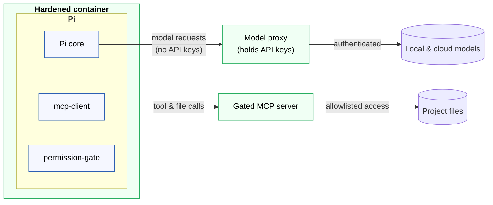

# Pi [![CI check pipeline status][ci-badge]][ci-workflow]

**🚧 Under construction.**

**My AI agent harness, built around the Pi coding agent framework.**

Pi is a minimal coding agent, a baseline framework for building your own
harness, rather a finished product. Out of the box it runs with full system
permissions and zero security controls. This project ships a suite of Pi
extensions, plus supporting infrastructure including a hardened container
and a gated MCP server, to compose a safe, controlled environment in which
to run agents in Pi.

The objective of this project is to compose a secure coding agent framework,
isolated from the host system, with full audit trails for every action
performed by agents, and seamlessly supporting a mix of both local
and cloud models.

Together with my [agent skills][agent-skills] and [Modelfiles](ollama-modelfiles)
for Ollama, this is my custom AI agent harness.

> [!WARNING]
> These tools are built for my personal use and they are volatile. They
> may change, break, or be removed at any time. They carry no support or
> stability guarantees. You're welcome, of course, to fork this repository and
> use it as a basis for engineering your own agent harness around Pi. But I
> don't recommend you use these tools as-is.

## 🎯 Intended use: away-from-keyboard

This harness is built for **away-from-keyboard agentic workflows** — an agent
working with minimal human oversight, where nobody is reading each tool call as
it happens. Every design decision follows from that one premise, and the
[requirements](./docs/requirements.md) state it first for that reason.

The cost is real and deliberate. Inside the hardened container the agent has no
shell, no Git, no network tools, and no route to the filesystem except a
mediated MCP server that logs every call — so it **cannot run your tests, build
the project, or install a dependency**. That is capability traded for
accountability, and the trade only pays when there is no human in the loop to
notice something going wrong.

**If you are at the keyboard, watching what the agent does, you do not need
this.** Eyes-on AI-assisted development in a normal editor is well served by a
much more minimal harness — Pi in a devcontainer with a mounted workspace, for
instance. You keep the agent's ability to run tests and builds, and *you* are
the control that this infrastructure otherwise has to reconstruct out of a
boundary and an audit trail. [Alternative designs](./docs/alternatives.md)
covers that setup and why it was rejected **for this use case** — not in
general; it is a perfectly reasonable way to work when someone is watching.

You can of course drive Pi interactively inside the hardened container, and the
operator affordances exist for exactly that: a read-only project mount to browse,
and an approval prompt before every write. But that is the harness being *usable*
by a human, not the case it was designed around.

## ☑️ Requirements

The core requirement, of course, is the [Pi coding agent][pi], installed locally
and in your `PATH`:

```sh
npm install -g @earendil-works/pi-coding-agent
```

To use the full hardened agent infrastructure, the following tools are required,
too:

- [Docker][docker] and the [Docker MCP Toolkit][docker-mcp-toolkit]
- [LiteLLM][lite-llm], **with the proxy extra**:

  ```sh
  pipx install 'litellm[proxy]'
  ```

  The `[proxy]` extra is not optional here. A plain `pip install litellm`
  installs the SDK but no `litellm` command, and `./run/startup` needs the
  proxy server on `PATH`.

## 🧭 Usage

There are two parts to this project:

* A suite of extensions for the Pi coding agent harness.

* Configurations for other tools with which Pi interacts, including an MCP
  server and a model proxy, creating a secure infrastructure within which AI
  agents operate.

Together, both sets of components form a cohesive, robust agent harness
architecture.



### Pi extensions

This repository packages the following Pi extensions. Click the links to see
their READMEs, which provide detailed usage instructions.

- [**`permission-gate`**](./src/extensions/permission-gate/README.md): \
  Interactive, default-deny confirmation gate on mutating tool calls, plus an
  absolute refusal of sensitive filenames on every call. Part of the security
  hardening infrastructure (see below).

- [**`mcp-client`**](./src/extensions/mcp-client/README.md): \
  MCP client giving Pi mediated filesystem access through the Docker MCP Toolkit
  gateway. Part of the security hardening infrastructure (see below)

- [**`pickling-penguins`**](./src/extensions/pickling-penguins/README.md): \
  Cosmetic-only replacement for Pi's "Working..." status line. Just for fun.

An install script is provided to automate the installation of these extensions
into Pi. First, make the script executable:

```sh
chmod +x run/install
```

Then run the script from the root of this repository:

```sh
./run/install
```

The available options are:

| Invocation              | Effect                                |
| ----------------------- | ------------------------------------- |
| `./run/install`         | Install all available extensions.     |
| `./run/install <name>…` | Install one or more named extensions. |
| `./run/install -l`      | List available extensions and exit.   |
| `./run/install --list`  | Same as `-l`.                         |
| `./run/install -h`      | Show usage help and exit.             |
| `./run/install --help`  | Same as `-h`.                         |

Examples:

```sh
./run/install                             # Install all extensions.
./run/install pickling-penguins           # Install the picking penguins extension only.
./run/install mcp-client permission-gate  # Install these two extensions only.
./run/install --list                      # See what's available to install.
```

Extensions are installed into `~/.pi/agent/extensions/`, where Pi will
auto-discover them next time it starts.

The same script can be used to update the installed extensions to the latest
versions in this repository. If an extension is already installed, it is first
backed-up to `~/.pi/agent/extensions/<name>.backup.<timestamp>/`.

Alternatively, you can manually install extensions simply by copying them
over. There is no build step.

```sh
cp -R src/extensions/pickling-penguins ~/.pi/agent/extensions/pickling-penguins
```

New and updated extensions will be loaded next time you run `pi`. If you're
already in Pi, use the `/reload` prompt to reload all extensions, skills, etc.:

```sh
/reload
```

> [!TIP]
> `/reload` is a useful for hot-reloading extensions
> during their development.

### Security hardening infrastructure

Beyond the extensions above, this repository also provisions a wider agent
harness infrastructure: a hardened container, a gated MCP filesystem server,
and a host-side model proxy. This is the part built for
[away-from-keyboard use](#-intended-use-away-from-keyboard) — if you are working
eyes-on, it buys you less than it costs you.

The effect of this hardened infrastructure is that a compromised agent or a
misbehaving model will have no access to host files, API keys or other secrets,
and no Docker control. (The MCP gateway does hold a host Docker socket, because
it spawns the MCP server — confined to a component the agent cannot reach. See
[the trade-off](./docs/solution.md#the-gateway-and-the-dockersock-trade-off).)

Plus every tool call an agent makes is logged — both what it attempted and what
the call actually did. Since the agent's only tools are filesystem tools, that
is every filesystem action it takes.

Model requests are **not** logged here. The host-side proxy is the component
positioned to do that, and this repository neither implements nor verifies it.

These components are installed and managed separately from the Pi extension.
See the [**infrastructure runbook**](./src/infrastructure/README.md) for
instructions.

## 📓 Developer documentation

See the [contributing guidelines](./CONTRIBUTING.md).

See also the [docs/](./docs/) directory for design decisions and trade-offs.

-----

Copyright © 2020-present Kieran Potts, [MIT license](./LICENSE.txt)

Acknowledgements: The structure of this project was inspired by
Owain Lewis's [`pi-extensions`][owain-pi-extensions].
Owain's "funny status" extension was the direct inspiration for
[`pickling-penguins`](./src/extensions/pickling-penguins/README.md),
my first Pi extension. The [Pi example extensions][pi-example-extensions]
are another useful reference point.

[agent-skills]: https://github.com/kieranpotts/skills
[ci-badge]: https://github.com/kieranpotts/pi/actions/workflows/check.yaml/badge.svg
[ci-workflow]: https://github.com/kieranpotts/pi/actions/workflows/check.yaml
[docker]: https://docker.com/
[docker-mcp-toolkit]: https://docs.docker.com/ai/mcp-catalog-and-toolkit/toolkit/
[lite-llm]: https://www.litellm.ai/
[ollama-modelfiles]: https://github.com/kieranpotts/modelfiles
[owain-pi-extensions]: https://github.com/owainlewis/pi-extensions/
[pi]: https://pi.dev/
[pi-example-extensions]: https://github.com/earendil-works/pi/blob/main/packages/coding-agent/examples/extensions/README.md
