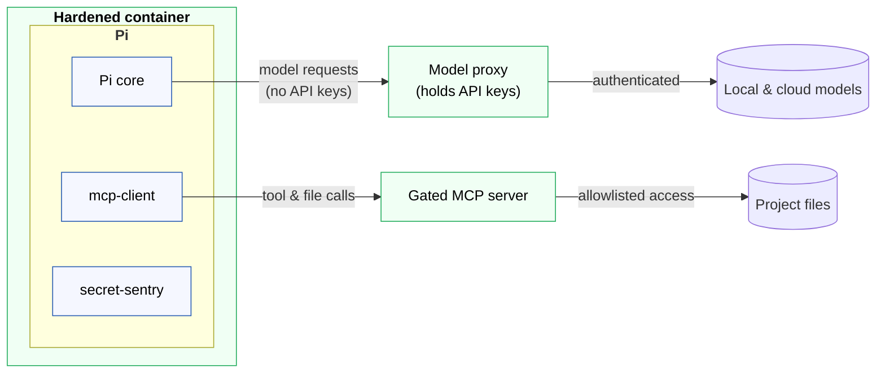

# Genie [![CI check pipeline status][ci-badge]][ci-workflow]

**🚧 Under construction.**

**My hardened agent harness, built around the Pi coding agent framework.**

Pi is a minimal coding agent, a baseline framework for building your own
harness, rather a finished product. Out of the box it runs with full system
permissions and zero security controls. Genie wraps it with a hardened
container, a gated MCP server, and a host-side model proxy, to compose a
safe, controlled environment in which to run agents in Pi.

The objective of this project is to compose a secure coding agent framework,
isolated from the host system, with full audit trails for every action
performed by agents, and seamlessly supporting a mix of both local
and cloud models.

Together with my [agent skills][agent-skills] and [Modelfiles](ollama-modelfiles)
for Ollama, this is my custom AI agent harness. For eyes-on, at-keyboard
extensions to Pi itself (no hardening, just conveniences), see my
[`pi`][pi-repo] repository instead.

> [!WARNING]
> These tools are built for my personal use and they are volatile. They
> may change, break, or be removed at any time. They carry no support or
> stability guarantees. You're welcome, of course, to fork this repository and
> use it as a basis for engineering your own agent harness around Pi. But I
> don't recommend you use these tools as-is.

## 🎯 Intended use: away-from-keyboard

This harness is built for **away-from-keyboard agentic workflows** — an agent
working with minimal human oversight, where nobody is reading each tool call as
it happens. Every design decision follows from that one premise, and the
[requirements](./docs/requirements.md) state it first for that reason.

The cost is real and deliberate. Inside the hardened container the agent has no
shell, no Git, no network tools, and no route to the filesystem except a
mediated MCP server that logs every call — so it **cannot run your tests, build
the project, or install a dependency**. That is capability traded for
accountability, and the trade only pays when there is no human in the loop to
notice something going wrong.

**If you are at the keyboard, watching what the agent does, you do not need
this.** Eyes-on AI-assisted development in a normal editor is well served by a
much more minimal harness — Pi in a devcontainer with a mounted workspace, for
instance. You keep the agent's ability to run tests and builds, and *you* are
the control that this infrastructure otherwise has to reconstruct out of a
boundary and an audit trail. [Alternative designs](./docs/alternatives.md)
covers that setup and why it was rejected **for this use case** — not in
general; it is a perfectly reasonable way to work when someone is watching.

You can of course drive Pi interactively inside the hardened container, and the
operator affordances exist for exactly that: a read-only project mount to browse,
and an approval prompt before every write. But that is the harness being *usable*
by a human, not the case it was designed around.

## ☑️ Requirements

The following tools are required to build and run the hardened infrastructure:

- [Docker][docker] and the [Docker MCP Toolkit][docker-mcp-toolkit]
- [LiteLLM][lite-llm], **with the proxy extra**:

  ```sh
  pipx install 'litellm[proxy]'
  ```

  The `[proxy]` extra is not optional here. A plain `pip install litellm`
  installs the SDK but no `litellm` command, and `genie` needs the proxy server
  on `PATH`.

The [Pi coding agent][pi] itself is baked into the hardened container image at
build time — you do not need it installed locally to use Genie.

## 📦 Installation

An install script places the project centrally and puts a `genie` command on
your `PATH`:

```sh
./run/install
```

| Invocation                | Effect                                                                  |
| ------------------------- | ----------------------------------------------------------------------- |
| `./run/install`           | Copy the payload and link `genie` onto `PATH`.                          |
| `./run/install --link`    | Symlink the payload to this working tree, so edits are live. For development. |
| `./run/install --uninstall` | Remove the payload and the command. Keeps your config and the audit logs. |
| `./run/install --help`    | Show usage help and exit.                                               |

It installs to XDG locations, honouring every override:

```text
~/.local/share/genie/    the payload: bin, lib, src
~/.config/genie/env      your cloud API keys, mode 0600
~/.local/bin/genie       a symlink to the payload's bin/genie
```

Re-running is how you update; only the payload is replaced. The config file is
created once and **never overwritten**, because it holds your cloud API keys and
the generated proxy master key. An existing `src/infrastructure/.env` is adopted
on a first install, so nothing has to be re-entered.

Fill the config in before the first run — it is created from the example and is
not usable as-is. This is step 1 of the
[operator runbook](./src/infrastructure/README.md#operator-runbook), and it is
deliberately manual: it needs your own cloud API keys and a generated secret.

```sh
$EDITOR ~/.config/genie/env
sed -i "s|^LITELLM_MASTER_KEY=.*|LITELLM_MASTER_KEY=$(openssl rand -hex 32)|" ~/.config/genie/env
```

## 🧭 Usage

`genie` runs an agent inside the boundary. Without `--tui` it takes a prompt and
prints the response, so it can be driven from a script:

```sh
genie --prompt "Which modules import the audit log?"    # response on stdout
genie --tui                                             # interactive session
```

| Invocation                   | Effect                                                            |
| ---------------------------- | ----------------------------------------------------------------- |
| `genie -p TEXT\|FILE\|-`     | Send one prompt; print the response. A file is read on the host.   |
| `genie TEXT...`              | Same, with the prompt as arguments.                                |
| `genie --tui`                | Interactive session, in the Pi terminal UI.                        |
| `genie -m ROLE`              | Route to a role: `computer-programmer` (default), `technical-lead`, `technical-writer`, `security-analyst`. |
| `genie -C DIR`               | The project to expose. Defaults to the working directory.          |
| `genie --json`               | Ask Pi for JSON rather than text.                                  |
| `genie --up`                 | Bring the boundary up and leave it running.                        |
| `genie --down`               | Stop the proxy and the containers.                                 |
| `genie --status`             | Report what is running, and against which project.                 |
| `genie --logs [WHICH]`       | Tail the audit trail: `all`, `audit`, `security`.                  |
| `genie --rebuild`            | Rebuild the image and recreate the containers.                     |

**`--project` is the security-relevant argument.** It becomes the only thing the
agent can reach, so it defaults to the working directory rather than to anything
broader, and `/` and `$HOME` are refused outright — scoping an agent to a home
directory would put your keys, credentials, and every other repository inside
its boundary.

**Stdout carries the response and nothing else.** Progress and warnings go to
stderr and the exit code is Pi's, so this composes with ordinary shell tools:

```sh
genie -p "Summarise the test suite." > summary.md
genie -p ./review-request.md --model security-analyst
echo "What does src/index.ts export?" | genie
```

`--json` is not a wrapper around the text output — it switches Pi into its
structured mode, which emits **one JSON event per line** (`session`,
`turn_start`, `message_start`/`message_update`/`message_end`, `agent_end`),
covering tool calls and token usage as well as the reply. Use it when you want
the whole trace; pull the final answer out with:

```sh
genie --json -p "..." | jq -rs 'map(select(.type=="message_end" and .message.role=="assistant"))
  | last | .message.content[] | select(.type=="text") | .text'
```

> [!IMPORTANT]
> **The stack is persistent.** The first invocation builds the image, brings up
> the containers, and starts the proxy; later ones reuse all three, so a prompt
> costs about a second rather than about a minute. Nothing is torn down until you
> ask — which means **a proxy holding your cloud API keys keeps running between
> invocations**. It listens only on `agent-net`'s gateway address, never on
> `0.0.0.0`, so the exposure is longer-lived rather than wider. `genie --status`
> shows it; `genie --down` stops it.

Switching `--project` re-points the volume and restarts the containers, because a
bind mount is fixed when a container is created. That is the one invocation that
is not fast.

Genie has two halves:

* Two Pi extensions — `mcp-client` and `secret-sentry` — that run inside the
  hardened container and form the in-Pi half of the security boundary.

* Supporting infrastructure: a hardened container, a gated MCP server, and a
  host-side model proxy, which together compose the boundary the extensions
  run inside.

Together, both halves form a cohesive, robust agent harness architecture.



### The Pi extensions

- [**`secret-sentry`**](./src/extensions/secret-sentry/README.md): \
  Unattended security controls for away-from-keyboard sessions — an absolute
  refusal of sensitive filenames on every call, and redaction of secret-shaped
  values from tool output before the model sees them. No interactive
  confirmation: writes proceed unprompted, and this is the system's audit
  trail instead.

- [**`mcp-client`**](./src/extensions/mcp-client/README.md): \
  MCP client giving Pi mediated filesystem access through the Docker MCP Toolkit
  gateway.

- [**`audit-log`**](./src/extensions/audit-log/README.md): \
  The generic activity trail — every call and its result, turn boundaries, and
  the *shape* of every model request. Records; decides nothing.

These extensions are not installed on the host, and `./run/install` does not
install them either — it installs the host tooling only. They are baked directly
into the hardened container image at build time, see the `COPY` lines in
[`src/infrastructure/pi-container/Dockerfile`](./src/infrastructure/pi-container/Dockerfile).
If you want to develop or test them against a local, unhardened Pi install,
copy them over manually. There is no build step.

```sh
cp -R src/extensions/secret-sentry ~/.pi/agent/extensions/secret-sentry
```

New and updated extensions will be loaded next time you run `pi`. If you're
already in Pi, use the `/reload` prompt to reload all extensions, skills, etc.:

```sh
/reload
```

### Security hardening infrastructure

Beyond the extensions above, this repository provisions a wider agent harness
infrastructure: a hardened container, a gated MCP filesystem server, and a
host-side model proxy. This is the part built for
[away-from-keyboard use](#-intended-use-away-from-keyboard) — if you are working
eyes-on, it buys you less than it costs you.

The effect of this hardened infrastructure is that a compromised agent or a
misbehaving model will have no access to host files, API keys or other secrets,
and no Docker control. (The MCP gateway does hold a host Docker socket, because
it spawns the MCP server — confined to a component the agent cannot reach. See
[the trade-off](./docs/solution.md#the-gateway-and-the-dockersock-trade-off).)

Plus every tool call an agent makes is logged — both what it attempted and what
the call actually did. Since the agent's only tools are filesystem tools, that
is every filesystem action it takes. The same log marks each turn boundary, so
calls are attributable to the instruction that caused them, and records the
**shape** of every model request: which model, how many messages, how many
bytes. Never the content of any of it — that is the rule the log is built on.

`genie` automates bringing the boundary up, and `./run/startup` is a thin wrapper
around `genie --tui` for use straight from a checkout. See the
[**infrastructure runbook**](./src/infrastructure/README.md) for the full
operator workflow, including the verification steps, which remain manual and are
worth re-running whenever the boundary's configuration changes.

## 📓 Developer documentation

See the [contributing guidelines](./CONTRIBUTING.md).

See also the [docs/](./docs/) directory for design decisions and trade-offs.

-----

Copyright © 2020-present Kieran Potts, [MIT license](./LICENSE.txt)

[agent-skills]: https://github.com/kieranpotts/skills
[ci-badge]: https://github.com/kieranpotts/genie/actions/workflows/check.yaml/badge.svg
[ci-workflow]: https://github.com/kieranpotts/genie/actions/workflows/check.yaml
[docker]: https://docker.com/
[docker-mcp-toolkit]: https://docs.docker.com/ai/mcp-catalog-and-toolkit/toolkit/
[lite-llm]: https://www.litellm.ai/
[ollama-modelfiles]: https://github.com/kieranpotts/modelfiles
[pi]: https://pi.dev/
[pi-repo]: https://github.com/kieranpotts/pi
