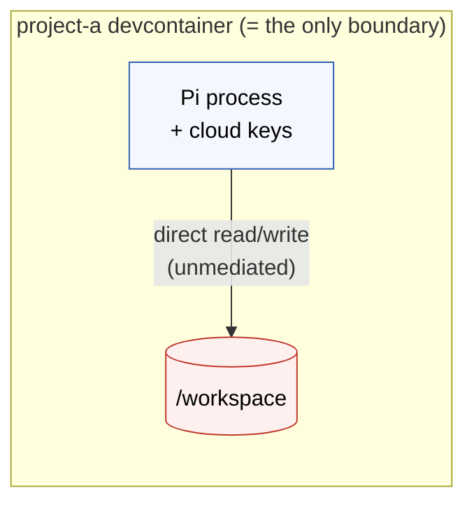
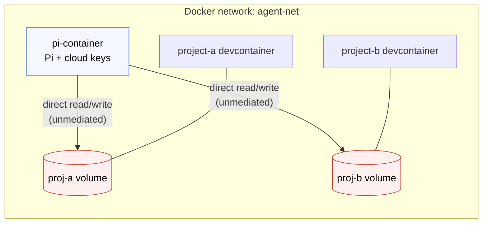
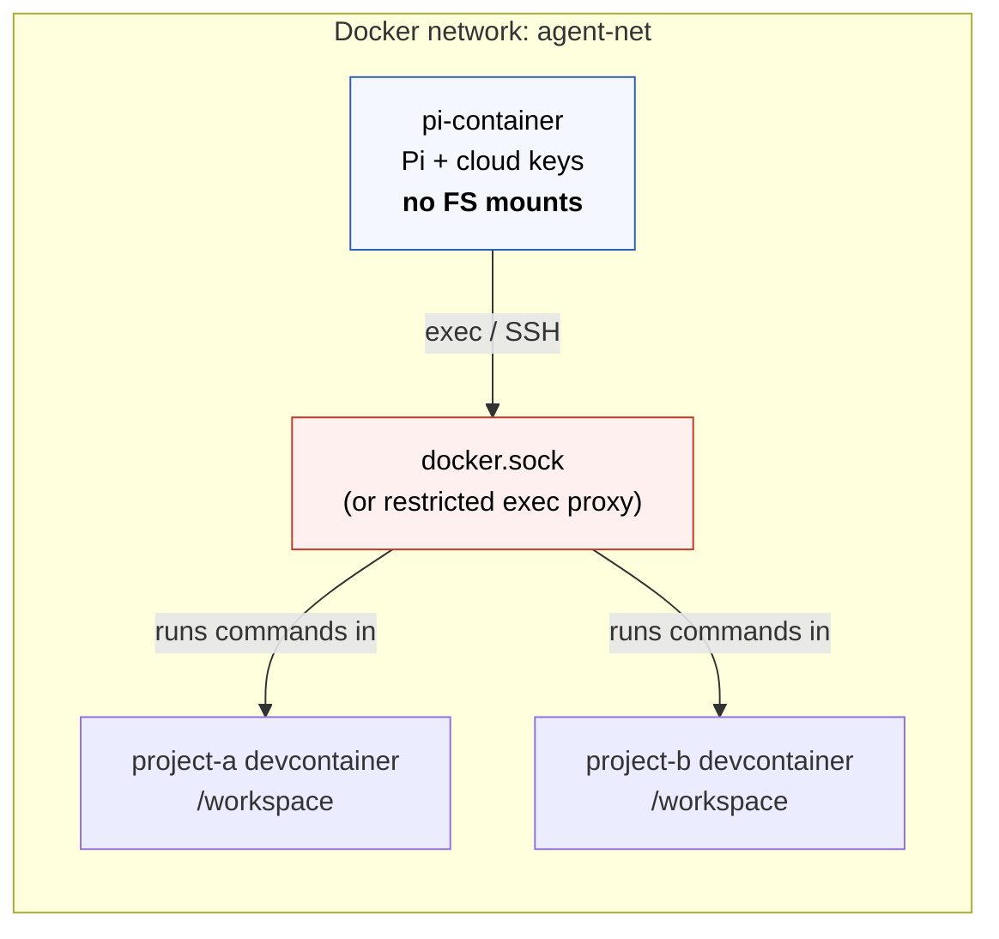

# Alternatives considered

Four isolation models were considered. They differ chiefly in **where Pi
runs** and **how it accesses project files**. Security — the primary
objective — is the deciding axis, but environment fidelity, persistence, and
complexity are noted for each. All four share the common container hardening
and host-side proxy described in [the solution](./solution.md); the proxy
(credential isolation) is recommended for every option, not just the chosen
one.

## Option 1 — Pi inside the devcontainer

Pi runs as a process within each project's devcontainer. The container
boundary *is* the project boundary *is* the agent boundary.

- **For:** Simplest possible setup — no inter-container networking. Pi runs in
  the project's own environment with the correct runtimes and tools present.
  No Docker socket. Fully compatible with standard devcontainer tooling. Each
  project gets an isolated Pi instance.
- **Against (security):** Pi has direct, unmediated read/write to the entire
  workspace by design — there is no filesystem policy enforcement point, and
  no audit trail of file operations beyond what an extension adds. Under
  injected-key mode, every project's Pi instance holds cloud keys, multiplying
  the blast radius. Session history is ephemeral unless persisted.
- **Why not chosen:** It optimizes for simplicity and environment fidelity at
  the direct expense of the objective. There is no place to express an
  inspectable filesystem policy; isolation is implicit in mount config only.

## Option 2 — Pi in its own container, shared named volumes

Pi runs in a dedicated container; project files live in named volumes shared
between Pi and the relevant devcontainer. Pi operates on files natively.

- **For:** A single, persistent, well-configured Pi instance across all
  projects, with stable config/extensions/history. No Docker socket. Pi and
  the devcontainer can work the same files simultaneously. With one
  container, the proxy is especially clean — one place keys could otherwise
  leak.
- **Against (security):** Pi still has direct filesystem access to every
  mounted project volume — cross-project access is controlled only by which
  volumes are mounted, i.e. by configuration discipline, not by an enforced
  policy. No per-operation audit trail. Pi also lacks project runtimes, so it
  cannot reliably run/test code. Named volumes are opaque on the host.
- **Why not chosen:** Better persistence than Option 1 but the same
  fundamental weakness — direct, unmediated filesystem access with no policy
  enforcement point or audit log.

## Option 3 — Pi in its own container, exec-based access

Pi runs in a dedicated container with no project mounts; it executes commands
*inside* target devcontainers via `docker exec` (or SSH) and observes
stdout/stderr.

- **For:** Pi runs in the correct project environment (runtimes, compilers,
  tools exactly as configured). Clean separation — Pi has no direct
  filesystem access to any project; commands run with the devcontainer's
  user/permissions. Can target multiple containers in sequence.
- **Against (security):** Requires either mounting `docker.sock` (a broad,
  dangerous host privilege — a compromised Pi could control every container
  on the host) or building/running a restricted exec proxy. Audit is limited
  to shell logs. Higher per-operation latency.
- **Why not chosen:** Strong on environment fidelity and avoids direct
  filesystem mounts, but the `docker.sock` requirement (even mitigated by a
  socket proxy allowlisting `exec` on named containers) introduces a
  privilege we would rather not grant at all. The mediation is shell-level,
  not structured or richly auditable.

## Option 4 — Pi in its own container, MCP server as mediator *(chosen)*

As described in [the solution](./solution.md). Pi has zero direct filesystem
access, no `docker.sock`, and (with the proxy) no cloud keys; all file access
is structured, policy-enforced, and logged.

- **Why chosen:** It is the only option that satisfies the primary objective
  in full — strongest filesystem isolation, an explicit and inspectable
  policy enforcement point, audit-by-default, and (paired with the proxy)
  complete credential isolation. The access-control policy is expressed in
  code, not Docker config, making it testable and version-controllable. Pi
  can also be swapped for any other MCP-compatible agent without changing the
  isolation layer. The wider ecosystem has converged on MCP-as-boundary as
  the standard for exactly this reason.
