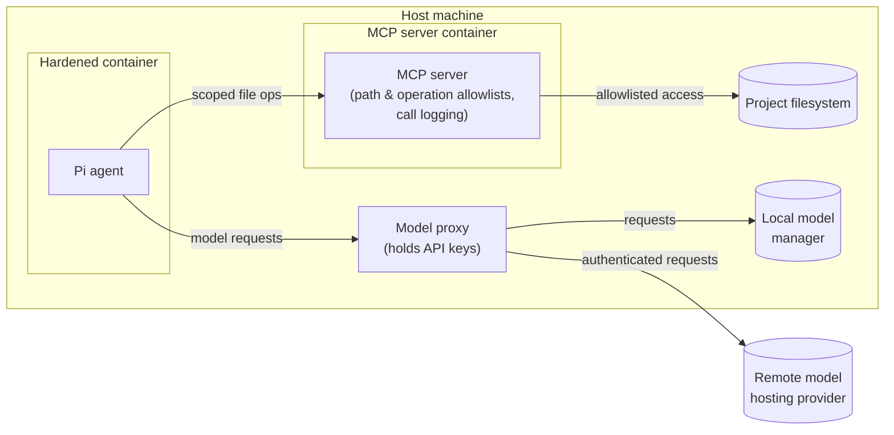
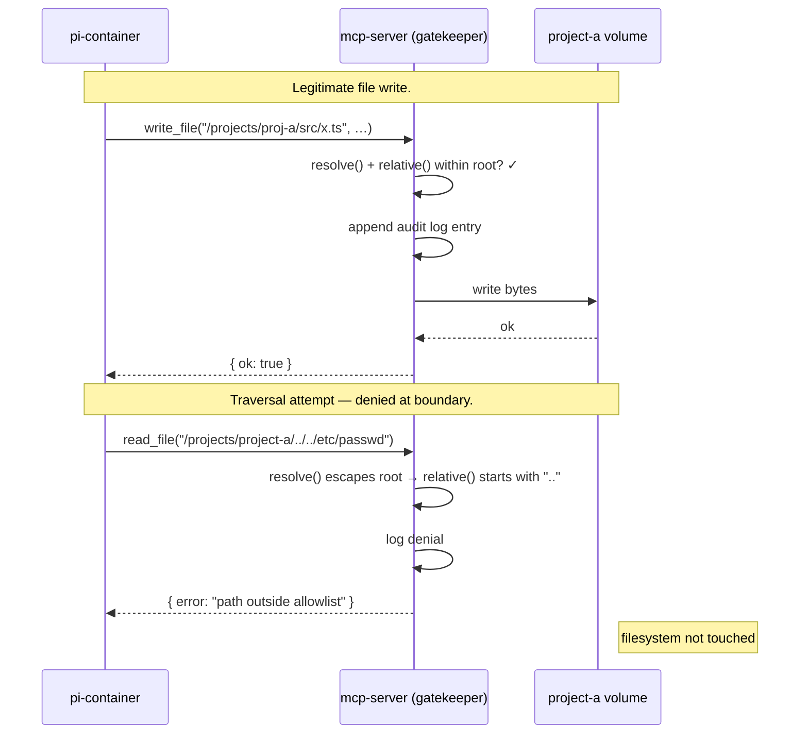
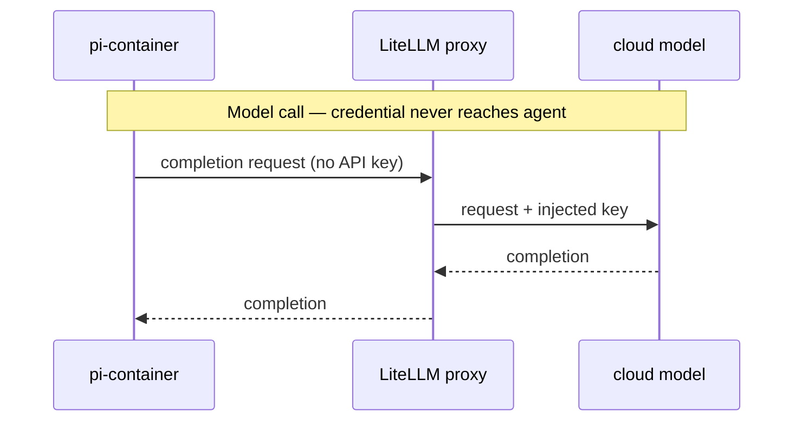
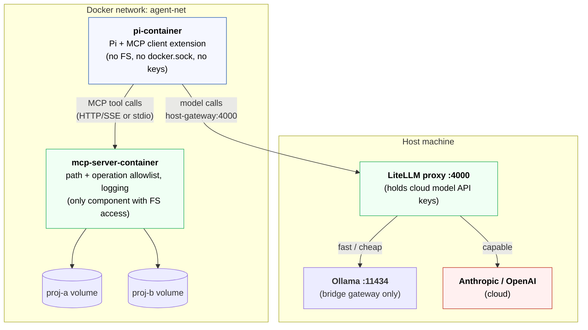

# The solution

I settled on an architecture that revolves around four components:

* A containerized Pi instance.
* A containerized MCP server.
* A proxy for routing traffic to both remote and local models.
* A dedicated Docker network connecting the above.



The security profile offered by this architecture meets my
[requirements](./requirements.md). It suits the regulated industries
I work in, and it travels well between different development environments.

## Containerized Pi agent

Pi runs in its own dedicated, hardened container — one that has no direct
access to the host filesystem, no project mounts, no Docker socket
(`docker.sock`), and no cloud API keys or other secrets.

All interactions with the outside world happen via:

* The MCP server (for tools and data access).
* The model proxy (for inference requests).

In simple terms, this means that a compromised agent or a misbehaving model
cannot reach host files, cloud credentials, or sibling projects.

The user experience is unchanged. Users interact with Pi in the normal way.
Only the plumbing beneath the agent changes.

## Containerized MCP server

Access to files, data, and tools is mediated by a containerized MCP server.
This is responsible for enforcing path and operation allowlists. It also logs
every call, providing full auditability.

Running MCP servers directly on the host machine would still give a model
access to the host filesystem, environment variables, and network. Putting
the MCP server in a Docker container keeps it isolated from the host
environment. Access to host files, secrets, and networks can thereby be
controlled.

For all operations that don't involve model inference, the agent issues MCP
tool calls. The containerized MCP server enforces what tool calls are allowed.
Thus, the MCP server becomes the gatekeeper to the host system. Access is
mediated using scoped allowlists. Every call is logged.



This aligns with emerging best practices for secure agent harnesses. MCP
(Model Context Protocol) has emerged as the _de facto_ isolation boundary for
agents, controlling an agent's access to filesystems, tools, and data, instead
of an agent having direct filesystem access.

Tooling in this solution space is mature. [Docker MCP Toolkit][docker-mcp-toolkit]
is a free feature of Docker Desktop that runs MCP servers in containers and
handles the plumbing to the agent client (whether that be Pi, LM Studio,
Claude Desktop, etc.).

Docker MCP Toolkit can be configured with environment variables, API keys, and
other secret credentials required by the agent, so the agent doesn't need to
hold these things itself. It also provides security checks for both tool calls
and the resulting outputs.

Docker MCP Toolkit meets all of my requirements, negating the need for a custom
MCP server solution.

## Model traffic proxy

Another piece of the jigsaw is to have some sort of proxy between the agent
and the model servers. This proxy holds the access credentials required to
access the model provider, whether that provider is remote or local.

This is an emerging pattern, and [LiteLLM][lite-llm] is emerging as the
_de facto_ standard. It is a lightweight model router, sitting between the agent
and the models the agent uses. LiteLLM presents a unified OpenAI-compatible API.



Moreover, LiteLLM can route requests to different local or cloud models based
on rules you define, allowing for the configuration of dynamic model routing
in response to the task at hand. You can also configure LiteLLM with per-model
token budgets and rate limits.

```
agent
  └── model router - eg. LiteLLM, Ollama proxy
        ├── local: ollama - low latency, no data leaves machine
        └── cloud: Anthropic API - for frontier model access
```

LiteLLM runs directly on the host, rather than in its own container like Pi and
the MCP server. This is because the proxy needs host-level access to reach local
model servers such as Ollama. It holds all cloud API keys and other model
credentials, so they stay out of reach of the model, too.

## High-level design

The diagram below shows the trust boundaries and what crosses each.



The view below adds some concrete mount/volume detail:

```
Host Machine
│
├── Ollama :11434 - bound to bridge gateway only, not 0.0.0.0
├── LiteLLM proxy :4000 - holds cloud model API keys, dynamic routing
│     ├── routes "fast/cheap" → Ollama local model
│     └── routes "capable"    → Anthropic / OpenAI cloud
│
└── Docker network: agent-net
    │
    ├── pi-container
    │   ├── Pi process + MCP client extension
    │   └── /home/pi - Pi config + session history (named volume)
    │                  No project mounts, no docker.sock, no keys
    │
    └── mcp-server-container
        ├── MCP server process
        │   Enforces: path allowlist, operation allowlist, per-project perms, logging
        ├── /projects/proj-a - scoped named volume (read/write)
        └── /projects/proj-b - scoped named volume (read/write)
```

[docker-mcp-toolkit]: https://docs.docker.com/ai/mcp-catalog-and-toolkit/toolkit/
[lite-llm]: https://www.litellm.ai/
