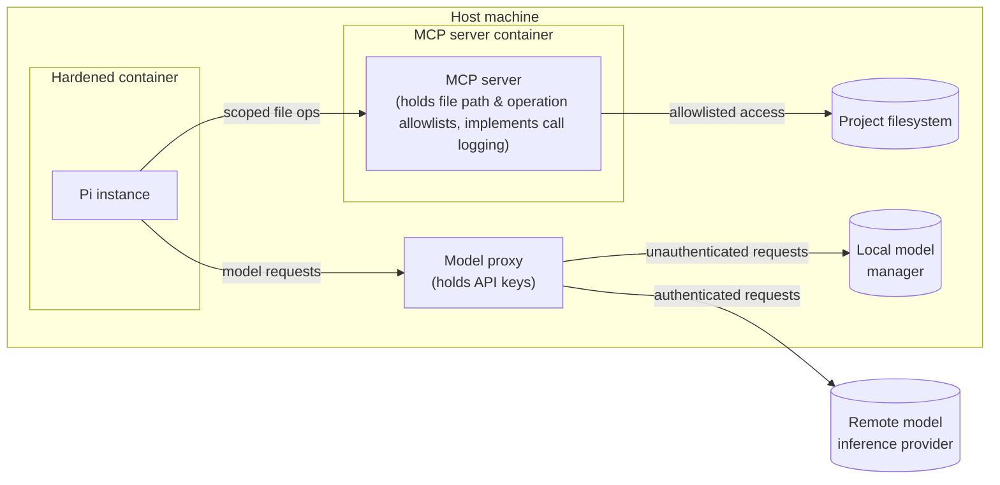
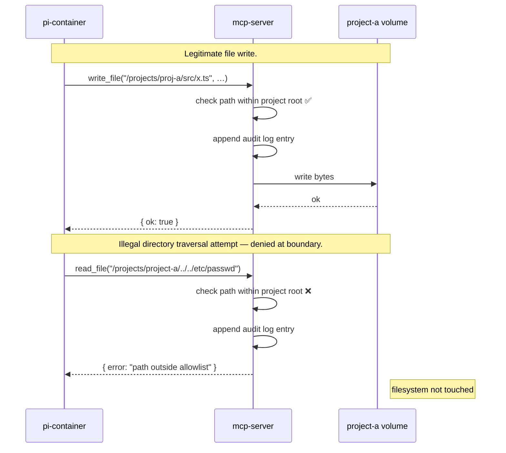
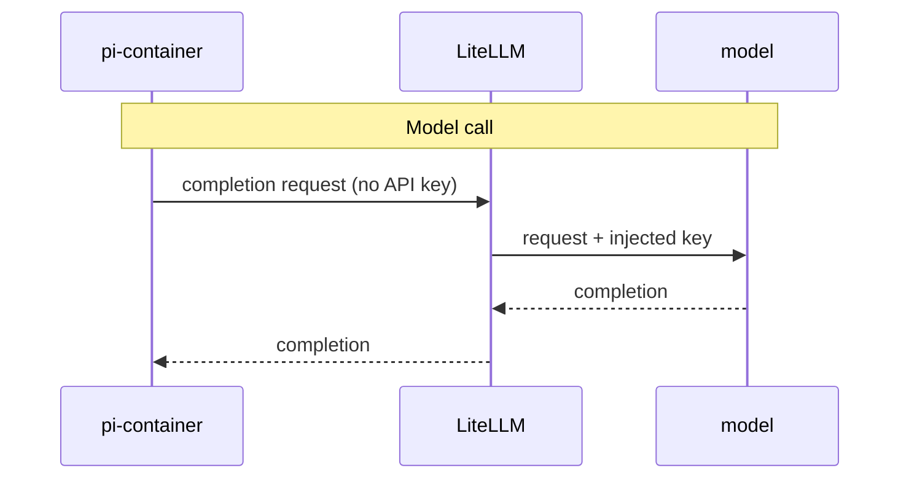
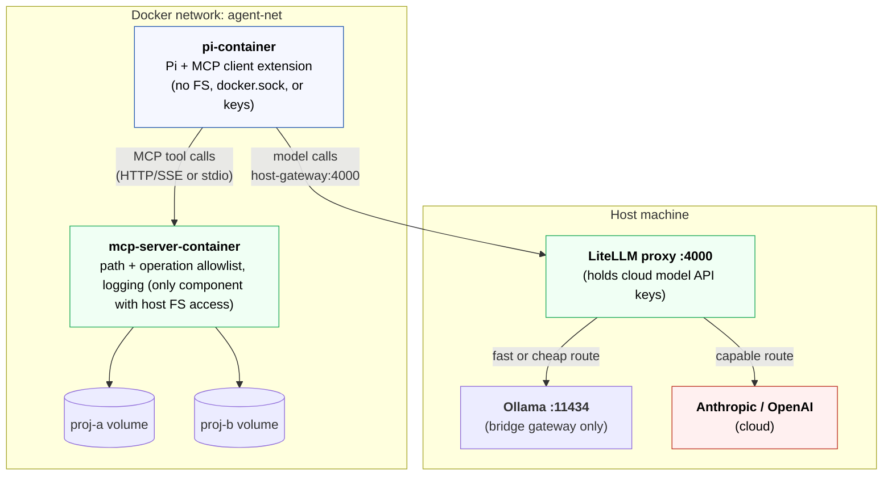

# The solution

I settled on an architecture that revolves around five components:

* Pi extensions.
* A containerized Pi instance.
* A containerized MCP server.
* A proxy for routing traffic to both remote and local model runtime engines.
* A dedicated Docker network connecting the above.



## Pi extensions

The first layer of defense in my hardened agent harness design is a suite of
Pi extensions that add security controls. The following hooks are used to
intercept tool and model calls from the harness.

- **The `tool_call` event.**
  Fires before any tool executes. Extensions can inspect and modify arguments
  before execution, or block entirely with `{ block: true, reason: string }`.
  This event is used to implement path allowlists, command denylists, and
  confirmation prompts.

- **The `tool_result` event.**
  Fires after tool execution, before the result is returned to the model.
  Handlers are chained as middleware. An extension can inspect, log, and modify
  the result. This is the place to implement redaction of sensitive content
  from tool output, before it enters the model context.

- **The `before_provider_request` event.**
  Fires after the provider payload is built, immediately before the outbound
  model API call. An extension can inspect or replace the full payload. This is
  the place to implement auditing of outbound model traffic.

- **The `before_agent_start` event.**
  Fires before each agent turn. Extensions can inject context, modify the
  system prompt, and record that a turn is beginning — useful for audit trail
  entries.

In addition, my extensions can use Pi's **tool overriding** behavior to replace
Pi's built-in tools such as `read`, `bash`, `edit`, `write`, `grep`, `find`,
and `ls`. All you do is register a new tool with the same name. Combined with
`--no-builtin-tools`, which starts Pi with no built-in tools at all, this
allows constructing a fully locked-down, audited tool surface.

## Containerized Pi instance

The next layer of defense is a dedicated, hardened container for running Pi
agents in. Guest agents have no direct access to the host filesystem, and
there are not even any project filesystem mounts. There's no access to Docker
sockets either, preventing badly behaving models from taking control of the
host's Docker daemon.

All interactions with the outside world happen via:

* The MCP server (for tools and data access).
* The model proxy (for inference requests).

The user experience is unchanged. Users interact with Pi in the normal way.
Only the plumbing beneath the agent changes.

An alternative to Docker would be to use Nvidia's
[OpenShell](https://build.nvidia.com/openshell). This provides a sandboxed
environment that keeps API credentials outside of the agent process. However,
Docker is acceptable if you have another keeping secrets away from the model.

## Containerized MCP server

Access to files, data, and tools is mediated by a containerized MCP (Model
Context Protocol) server. This is responsible for enforcing path and operation
allowlists. It also logs every call, providing full auditability.

Running MCP servers directly on the host machine would still give a model
access to the host filesystem, environment variables, and network. Putting
the MCP server in a Docker container keeps the model isolated from the host
environment.

For all operations that don't involve model inference, the agent issues MCP
tool calls. The containerized MCP server enforces what tool calls are allowed.
Thus, the MCP server becomes the gatekeeper to the host system. Access is
mediated using scoped allowlists. Every call is logged.



This design aligns with emerging best practices for secure agent harnesses. MCP
has emerged as the _de facto_ isolation boundary for agents, controlling an
agent's access to filesystems, tools, and data.

Tooling in this solution space is mature. I've chosen to use
[Docker MCP Toolkit][docker-mcp-toolkit]. It runs MCP servers in containers
and handles the plumbing to the agent client. Docker MCP Toolkit can also be
configured with environment variables, API keys, and any other secrets required
by an agent. It acts as a proxy for this information, to secrets never enter
a model's context.

Docker MCP TOols also has built-in security checks for both tool calls and the
resulting outputs.

## Model traffic proxy

Similar to how an MCP server mediates an agent's access to tools and data, so
another proxy sites between the agent and the model runtimes. This proxy holds
the access credentials required to access model inference providers.

This design means that cloud credentials and other secrets are never injected
into running agent containers — not via environment variables, not mounted into
containers via config files, and not baked into container images. The agent
container is only given the model's proxy endpoint.

This is an emerging design pattern, and [LiteLLM][lite-llm] is emerging as the
_de facto_ standard. It is a lightweight model router, sitting between the agent
and the models the agent uses, and presenting a unified OpenAI-compatible API.



LiteLLM can route requests to different local or cloud models based on rules
you define, allowing for the configuration of dynamic model routing in response
to the task at hand. You can also configure LiteLLM with per-model token
budgets and rate limits.

```
agent
  └── model router (LiteLLM)
        ├── local (eg. ollama - low latency, no data leaves machine)
        └── cloud (eg. Anthropic API - for frontier model access)
```

LiteLLM runs directly on the host, rather than in its own container like Pi and
the MCP server. This is because the proxy needs host-level access to reach local
model servers such as Ollama.

## High-level design

The following provides alternative views of the high-level design.

The diagram below shows the trust boundaries, and what data crosses them.



The view below adds some concrete mount/volume detail.

```
Host Machine
│
├── Ollama :11434 - bound to bridge gateway only, not 0.0.0.0
│
├── LiteLLM proxy :4000 - holds cloud model API keys, dynamic routing
│     ├── routes "fast/cheap" → Ollama local model
│     └── routes "capable"    → Anthropic / OpenAI cloud
│
└── Docker network: agent-net
    │
    ├── pi-container
    │   ├── Pi process + MCP client extension
    │   └── /home/pi - Pi config + session history (saved to named volume)
    │
    └── mcp-server-container
        ├── MCP server process
        │   Enforces path allowlist, operation allowlist, per-project perms, logging
        │
        ├── /projects/proj-a - scoped named volume (read/write)
        └── /projects/proj-b - scoped named volume (read/write)
```

The following table summarizes all the custom security hardening solutions
implemented in my agent harness infrastructure. This view adds more detail
to what's described above.

| Requirement                         | Hardening solution                                                                                                                                                      |
|-------------------------------------|-------------------------------------------------------------------------------------------------------------------------------------------------------------------------|
| Filesystem access control           | File access mediated by MCP server, connected by `mcp-client` extension. Plus `audited-tools` extension enforces a path allowlist and blocks access to sensitive files. |
| Command execution control           | `bash` replacement (via `audited-tools`) never invokes a shell, rejects control operators, and runs only allowlisted programs.                                          |
| Permission prompts / approval gates | `permission-gate` extension requires interactive confirmation for writes/edits/execution (`tool_call` events). Denies access by default.                                |
| Audit log of tool calls             | Append-only JSONL logs, on a dedicated volume, for every fs/bash call and every tool approve/deny decision.                                                             |
| API key isolation from agent        | Host-side LiteLLM proxy holds API keys (eg. `ANTHROPIC_API_KEY`/`OPENAI_API_KEY`). Agent container gets a proxy endpoint + low-value rotatable proxy token.             |
| Extension vetting / signing         | Extensions require manual review. Third-party packages MUST be pinned to exact versions/commit hashes.                                                                  |
| Network egress control              | Container has no host networking. Reaches the model only via the host proxy over a private bridge network.                                                              |
| Container hardening                 | Non-root user, `--cap-drop ALL`, `no-new-privileges`, read-only rootfs with tmpfs `/tmp`, memory/CPU/PIDs limits, no `docker.sock`, no project or host-dotfile mounts.  |
| Startup telemetry / network calls   | `PI_OFFLINE=1` / `PI_SKIP_VERSION_CHECK=1` disable Pi's built-in telemetry and version-check calls, so the only outbound network is the proxy and the MCP gateway.      |
| Session data retention              | `sessionDir` set to a named volume outside the project tree (`pi-sessions`). JSONL logs hold the full conversation, including file content reads.                       |
| Session data encryption at rest     | NOT IMPLEMENTED. Depends on the host volume back-end (eg. an encrypted disk).                                                                                           |
| Data classification                 | NOT IMPLEMENTED. No extension currently inspects tool content by sensitivity beyond the filename-pattern refusal in `path-guard.ts`.                                    |
| Prompt injection defense            | OUT-OF-SCOPE for the agent harness. This is a model-level concern.                                                                                                      |

[docker-mcp-toolkit]: https://docs.docker.com/ai/mcp-catalog-and-toolkit/toolkit/
[lite-llm]: https://www.litellm.ai/
