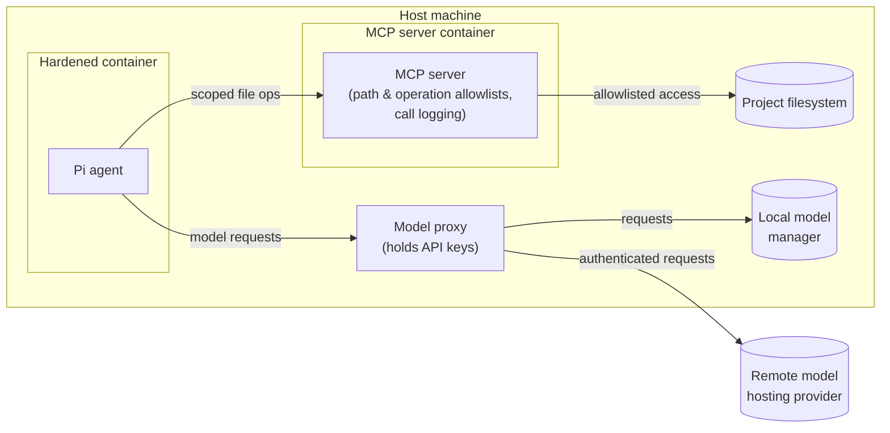

# The solution

I settled on an architecture that revolves around four components:

* A containerized Pi instance.
* A containerized MCP server.
* A proxy for routing traffic to both remote and local models.
* A dedicated Docker network connecting the above.



## Containerized Pi agent

Pi runs in its own dedicated, hardened container — one that has no direct
access to the host filesystem, no project mounts, no Docker socket
(`docker.sock`), and no cloud API keys or other secrets.

The user experience is unchanged. Users interact with Pi in the normal way.
Only the plumbing beneath the agent changes.

## Containerized MCP server

Access to project files is mediated by a separate containerized MCP server.
This is responsible for enforcing path and operation allowlists. It also logs
every call, providing full auditability.

Running MCP servers directly on the host machine would still give a model
access to the host filesystem, environment variables, and network. Putting
the MCP server in a Docker container keeps it isolated from the host
environment. Access to host files, secrets, and networks can thereby be
controlled.

Thus, agents issue MCP tool calls, and the containerized MCP servers enforce
what's actually accessible. The containerized MCP server becomes the
single gatekeeper to the host system.

Tooling in this solution space is mature. **Docker MCP Toolkit** is a free
feature of Docker Desktop that run MCP servers in containers and handles the
plumbing to the agent client (whether that be Pi, LM Studio, Claude Desktop,
etc.). Docker MCP Toolkit can be configured with environment variables, API
keys, and other secret credentials required by the agent, so the agent doesn't
need to hold these things itself. It also provides security checks for both
tool calls and the resulting outputs.

## Model traffic proxy

Another piece of the jigsaw is to have some sort of proxy between the agent
and the model servers. This proxy holds the access credentials required to
access the models servers, whether those servers are remote or local.

This is an emerging pattern, and **LiteLLM** is emerging as the _de facto_
standard. It is a lightweight proxy, aka. model router, between the agent and
the models it uses. It presents a unified OpenAI-compatible API and dynamically
routes to local or cloud models based on rules you define. You can even
configure it with per-model token budgets and rate limits.

LiteLLM runs directly on the host (alongside Ollama), rather than in its own
container like Pi and the MCP server. This is a deliberate trade-off: the
proxy needs host-level access to reach local model servers such as Ollama,
and it is the only component trusted to hold cloud credentials. It is,
therefore, the one part of the architecture that sits outside the
containerized isolation boundary.

```
agent
  └── model router - eg. LiteLLM, Ollama proxy
        ├── local: ollama - low latency, no data leaves machine
        └── cloud: Anthropic API - for frontier model access
```

## Security profile

This architecture provides a very strong security profile. The agent never
touches the host filesystem directly. Instead, access is mediated and logged
through scoped allowlists, and secrets and other credentials stay out-of-reach
of the model, too.

In simple terms, this architecture means that a compromised agent or a
misbehaving model cannot reach host files, cloud credentials, or sibling
projects.

This security profile meets my [requirements](./requirements.md). It suits the
regulated industries I work in, and it travels well between different
development environments.

It also aligned with emerging best practices for secure agent harnesses.
MCP (Model Context Protocol) has emerged as the _de facto_ standard for
controlling an agent's access to filesystems, tools, and data. Instead of
an agent having direct filesystem access, it calls MCP servers that expose
specific, scoped operations.

## Trade-offs

This architecture adds some complexity, but it is still pretty lightweight and
highly portable. There is only a small performance hit — network hops for every
file operation, between Pi and the MCP server, and for every model call, from
Pi to the proxy. But this too is acceptable for local development.
