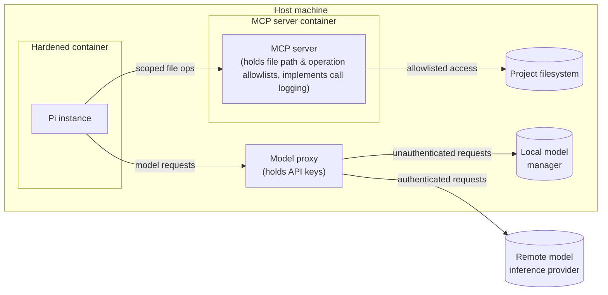
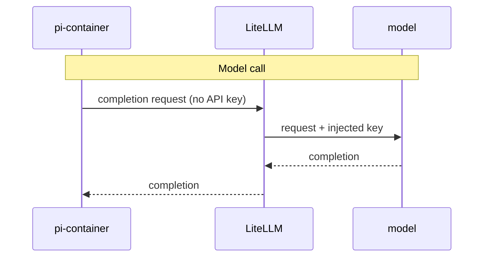
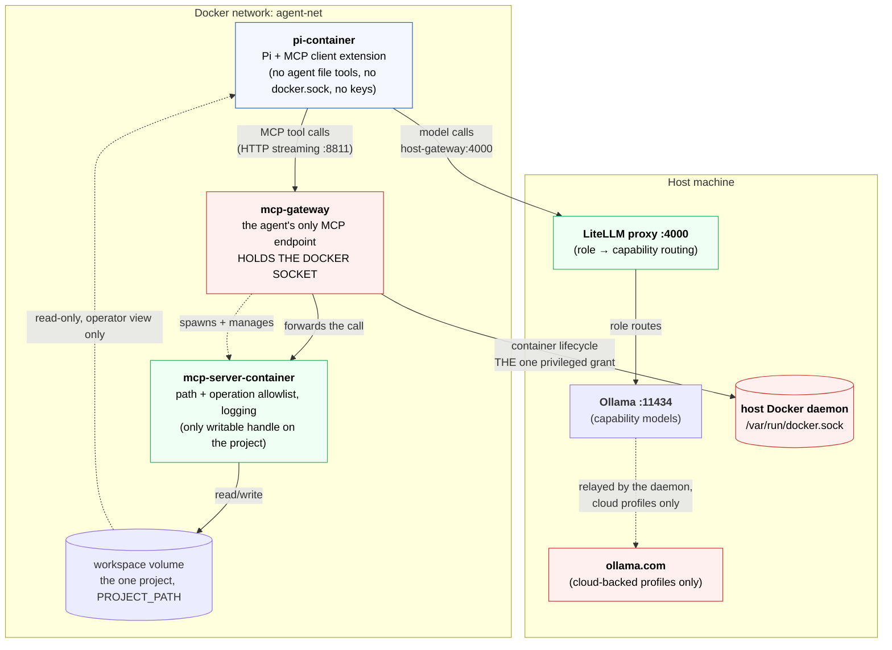

# The solution

I settled on an architecture that revolves around five components:

* Pi extensions.
* A containerized Pi instance.
* A containerized MCP server.
* A proxy for routing traffic to both remote and local model runtime engines.
* A dedicated Docker network connecting the above.



## Pi extensions

The first layer of defense in my hardened agent harness design is a suite of
Pi extensions that add security controls. The following hooks are used to
intercept tool and model calls from the harness.

- **The `tool_call` event.**
  Fires before any tool executes. Extensions can inspect and modify arguments
  before execution, or block entirely with `{ block: true, reason: string }`.
  This event is used to implement path allowlists, command denylists, and
  confirmation prompts.

- **The `tool_result` event.**
  Fires after tool execution, before the result is returned to the model.
  Handlers are chained as middleware. An extension can inspect, log, and modify
  the result. This is the place to implement redaction of sensitive content
  from tool output, before it enters the model context.

- **The `before_provider_request` event.**
  Fires after the provider payload is built, immediately before the outbound
  model API call. An extension can inspect or replace the full payload. This is
  the place to implement auditing of outbound model traffic.

- **The `before_agent_start` event.**
  Fires before each agent turn. Extensions can inject context, modify the
  system prompt, and record that a turn is beginning — useful for audit trail
  entries.

In addition, my extensions can use Pi's **tool overriding** behavior to replace
Pi's built-in tools such as `read`, `bash`, `edit`, `write`, `grep`, `find`,
and `ls`. All you do is register a new tool with the same name. Combined with
`--no-builtin-tools`, which starts Pi with no built-in tools at all, this
allows constructing a fully locked-down, audited tool surface.

This project uses the second half of that and deliberately not the first. An
overriding tool runs inside the agent's own process, so any policy it enforces
is cooperative — the agent is asked to police itself. `--no-builtin-tools`
removes the capability outright instead, and `mcp-client` hands back only the
`mcp_*` tools, whose containment is enforced in another container. See
`TODO.md` for the removal of the `audited-tools` extension, which made this
argument concrete.

## Containerized Pi instance

The next layer of defense is a dedicated, hardened container for running Pi
agents in. Guest agents have no direct access to the host filesystem. There's
no access to Docker sockets either, preventing badly behaving models from
taking control of the host's Docker daemon.

Be precise about the scope of that last claim: it is about the **agent's**
container. One component of the stack — the MCP gateway — does hold a host
Docker socket, because it spawns the MCP server. The requirement in
`docs/requirements.md` that a compromised agent must not reach "host Docker
control" is met by confining that privilege to a component the agent cannot
reach, not by the stack holding no privilege anywhere. See
[the `docker.sock` trade-off](#the-gateway-and-the-dockersock-trade-off) below.

The container does carry one project mount, at `/workspace`, and it is worth
being precise about who it is for. It is mounted **read-only, for the human
operator** — someone who enters the container needs to see what they are
working with. It is not the agent's route to files and cannot become one:
Pi runs with `--no-builtin-tools`, so it has no `read`, `grep`, `find`, or
`edit` to point at that mount, and no extension restores them. The `mcp_*`
tools are the agent's only file surface, and they resolve inside the MCP
server's container, not this one. The `:ro` flag is the backstop — even if a
local tool were ever restored, the only *writable* handle on the project
stays with the MCP server, so the audit trail of changes remains complete.

All interactions with the outside world happen via:

* The MCP server (for tools and data access).
* The model proxy (for inference requests).

### The agent's tool surface, exhaustively

"The agent has no local tools" is easy to read as a figure of speech. It is
literal, and this is the entire list — enumerated here because a reader should
not have to infer a security boundary from three flags in a launcher script.

Everything the model can call, verified against the running stack (`tools/list`
on the gateway) rather than from the design's intent:

| Tool | Arguments | Kind |
|---|---|---|
| `mcp_read_file` | `path` | read |
| `mcp_read_multiple_files` | `paths` | read |
| `mcp_list_directory` | `path` | read |
| `mcp_directory_tree` | `path` | read |
| `mcp_search_files` | `path`, `pattern`, `excludePatterns` | read |
| `mcp_get_file_info` | `path` | read |
| `mcp_list_allowed_directories` | — | read |
| `mcp_write_file` | `path`, `content` | write — **operator-confirmed** |
| `mcp_edit_file` | `path`, `edits`, `dryRun` | write — **operator-confirmed** |
| `mcp_move_file` | `source`, `destination` | write — **operator-confirmed** |
| `mcp_create_directory` | `path` | write — **operator-confirmed** |

Eleven tools. All filesystem. All resolve inside the MCP server's container,
confined to `/workspace`. The four writes require interactive approval; any of
the eleven is refused outright if it names a sensitive file; and every call,
read or write, is logged (`permission-gate`).

That is the complete surface because only two extensions ship in the image —
`mcp-client`, which registers exactly the tools above, and `permission-gate`,
which registers none and only observes.

**No `bash`, and no execution of any kind.** Pi ships seven built-in tools —
`read`, `bash`, `edit`, `write`, `grep`, `find`, `ls` — and `start-pi` launches
with `--no-builtin-tools`, so none of them is offered to the model. This is the
control, not tidying: those built-ins operate on *this* container's filesystem,
which carries the project at `/workspace`, so leaving them enabled would hand
the agent an unmediated, unlogged route to every project file. There is no
`audited-tools` extension restoring a guarded `bash` either; it was removed
because a guard inside the agent's own process is cooperative, not a boundary.

**No Git.** There is no `git` tool and no `git` binary in the image. Version
control is the operator's job, on the host, where the audit trail of what the
agent changed is reviewed before anything is committed.

**No web fetch.** Pi ships no web or HTTP tool at all — the built-in list above
is the whole of it — and no extension adds one. The agent cannot retrieve a URL.

**No network binaries.** `curl`, `wget`, `nc`, and `ssh` are all absent from the
image, so even a future execution tool would find nothing to reach the network
with.

What this costs is real and worth stating: the agent **cannot run the project's
tests, build it, install a dependency, or check out a branch**. It reads and
edits files, and nothing else. If that ever needs to change, `TODO.md` records
the design for an out-of-process exec MCP server — deliberately not an extension
inside the agent, for the reason given above.

> [!NOTE]
> This is a statement about the agent's **tool surface**, not about network
> reachability. The container sits on an ordinary Docker bridge with outbound
> NAT; nothing in the tool surface can use it today, but that is an absence of
> capability rather than an enforced egress boundary. See `TODO.md`.

The user experience is unchanged. Users interact with Pi in the normal way.
Only the plumbing beneath the agent changes.

An alternative to Docker would be to use Nvidia's
[OpenShell](https://build.nvidia.com/openshell). This provides a sandboxed
environment that keeps API credentials outside of the agent process. However,
Docker is acceptable if you have another mechanism keeping secrets away from
the model.

## Containerized MCP server

Access to files, data, and tools is mediated by a containerized MCP (Model
Context Protocol) server. This is responsible for enforcing path and operation
allowlists. It also logs every call, providing full auditability.

Running MCP servers directly on the host machine would still give a model
access to the host filesystem, environment variables, and network. Putting
the MCP server in a Docker container keeps the model isolated from the host
environment.

For all operations that don't involve model inference, the agent issues MCP
tool calls. The containerized MCP server enforces what tool calls are allowed.
Thus, the MCP server becomes the gatekeeper to the host system. Access is
mediated using scoped allowlists. Every call is logged.

The allowlist is a single directory: `/workspace`, the one project this stack
is scoped to (see `docs/requirements.md`). That boundary is declared in the
Docker MCP Toolkit catalog entry (`src/infrastructure/mcp/toolkit/catalog.yaml`),
whose `command` argument is the allowed directory and whose `volumes` entry is
all the spawned server can see. Those two must name the same path — if they
disagree, the server confines itself to a directory it cannot reach and every
call fails.

### The gateway, and the `docker.sock` trade-off

The MCP server is not a sibling container that compose starts. The **Docker MCP
Toolkit gateway** starts it: the agent connects to the gateway, and the gateway
spawns and manages the `mcp/filesystem` server from the catalog entry above.
That indirection is why the catalog file exists at all — and it has a
consequence that belongs here rather than only in the compose comments.

**Because the gateway orchestrates containers, it holds the host Docker
socket.** `compose.yaml` binds `/var/run/docker.sock` into the `mcp-gateway`
service. This is real host privilege: control of the Docker daemon is control of
the host, and it is the single most privileged thing in this design.

`docs/requirements.md` names this exact risk — a compromised agent must not
reach "host Docker control" — so the design has to answer for it. The answer is
**confinement, not absence**. The privilege exists, but on a component the agent
cannot reach:

* The **agent** container has no socket, no cloud keys, and no writable project
  mount. Nothing it can call reaches the daemon: it has no local execution tool
  at all, and its `mcp_*` tools resolve inside the filesystem server's
  container.
* The **gateway** is not addressable from outside the stack. `agent-net` is a
  private bridge, port 8811 is not published to the host, and its only other
  member is the agent container.
* The gateway is hardened as far as its role permits — `cap_drop: [ALL]`,
  `no-new-privileges`, read-only rootfs with in-memory tmpfs, and memory/PID
  limits. The socket is the irreducible privilege; everything else is shut.

So the requirement is met at the boundary that matters — the agent — rather than
by the stack holding no privilege anywhere. That distinction is the honest
version of the claim, and the diagrams below name the gateway explicitly so they
cannot be read the other way.

Two escape hatches, should the raw socket bind be unacceptable:

* Replace it with a
  [docker-socket-proxy](https://github.com/Tecnativa/docker-socket-proxy)
  allowlisting only the container APIs the gateway needs.
* Run `mcp/filesystem` directly over stdio without the gateway — at the cost of
  the Toolkit's catalog, secret, and network controls.

`src/infrastructure/README.md` covers both, with the operational detail and the
catalog-schema caveats that go with them.


This design aligns with emerging best practices for secure agent harnesses. MCP
has emerged as the _de facto_ isolation boundary for agents, controlling an
agent's access to filesystems, tools, and data.

Tooling in this solution space is mature. I've chosen to use
[Docker MCP Toolkit][docker-mcp-toolkit]. It runs MCP servers in containers
and handles the plumbing to the agent client. Docker MCP Toolkit can also be
configured with environment variables, API keys, and any other secrets required
by an agent. It acts as a proxy for this information, so secrets never enter
a model's context.

Docker MCP Toolkit also has built-in security checks for both tool calls and the
resulting outputs.

## Model traffic proxy

Similar to how an MCP server mediates an agent's access to tools and data, so
another proxy sits between the agent and the model runtimes. This proxy holds
the access credentials required to access model inference providers.

This design means that cloud credentials and other secrets are never injected
into running agent containers — not via environment variables, not mounted into
containers via config files, and not baked into container images. The agent
container is only given the model's proxy endpoint.

This is an emerging design pattern, and [LiteLLM][lite-llm] is emerging as the
_de facto_ standard. It is a lightweight model router, sitting between the agent
and the models the agent uses, and presenting a unified OpenAI-compatible API.



LiteLLM can route requests to different local or cloud models based on rules
you define, allowing for the configuration of dynamic model routing in response
to the task at hand. You can also configure LiteLLM with per-model token
budgets and rate limits.

```
agent
  └── model router (LiteLLM)
        ├── local (eg. ollama - low latency, no data leaves machine)
        └── cloud (eg. Anthropic API - for frontier model access)
```

LiteLLM runs directly on the host, rather than in its own container like Pi and
the MCP server. This is because the proxy needs host-level access to reach local
model servers such as Ollama.

## High-level design

The following provides alternative views of the high-level design.

The diagram below shows the trust boundaries, and what data crosses them.



The gateway is drawn in the danger style deliberately: it is the one component
holding host privilege. The agent has no path to it other than MCP tool calls,
and no path to the daemon at all.

The view below adds some concrete mount/volume detail.

```
Host Machine
│
├── Ollama :11434 - on loopback; the proxy runs on the host and reaches it there
│     └── capability models built by the modelfiles project. The profile built
│         there decides local vs. cloud-backed; cloud ones are relayed to
│         ollama.com by the daemon, under the daemon's own identity.
│
├── LiteLLM proxy :4000 - routes a ROLE to a CAPABILITY; holds no provider key
│     ├── "computer-programmer" → Ollama computer-programming
│     ├── "technical-lead"      → Ollama technical-reasoning
│     ├── "technical-writer"    → Ollama prose-writing
│     └── "security-analyst"    → Ollama security-analysis
│
└── Docker network: agent-net
    │
    ├── pi-container
    │   ├── Pi process + MCP client extension
    │   ├── /home/pi - Pi config + session history (saved to named volume)
    │   ├── /var/log/pi - the tool-call audit trail (named volume)
    │   └── /workspace - the project, READ-ONLY, for the operator to browse.
    │         The agent has no local tool that can read it.
    │
    ├── mcp-gateway - the agent's only MCP endpoint, on :8811 (unpublished)
    │   ├── /etc/mcp/catalog.yaml - READ-ONLY. Declares the boundary: the
    │   │     allowed directory and what the spawned server can see.
    │   ├── /workspace - the project volume, passed through to the server
    │   │     it spawns.
    │   └── /var/run/docker.sock - THE HOST DOCKER SOCKET. The one
    │         privileged mount in the stack, required because the gateway
    │         spawns and manages the MCP server container. Never granted
    │         to the agent. See the docker.sock trade-off above.
    │
    └── mcp-server-container - spawned BY THE GATEWAY, not by compose
        ├── MCP server process
        │   Enforces path allowlist, operation allowlist, logging
        │
        └── /workspace - the same named volume (read/write). The only
              writable handle on the project. One project per stack;
              a second project means a second stack.
```

The following table summarizes all the custom security hardening solutions
implemented in my agent harness infrastructure. This view adds more detail
to what's described above.

| Requirement                         | Hardening solution                                                                                                                                                      |
|-------------------------------------|-------------------------------------------------------------------------------------------------------------------------------------------------------------------------|
| Filesystem access control           | ALL agent file access mediated by the MCP server, reached by the `mcp-client` extension. The project is mounted read-only in the agent container for the human operator to browse; the agent has no local tool that can read it (`--no-builtin-tools`, and no extension restores one), and the MCP server holds the only writable handle. |
| Project scoping                     | Exactly ONE project per stack, at `/workspace`, set by `PROJECT_PATH`. The allowlist is therefore a single directory rather than a per-project permission model — see `docs/requirements.md` for why this is a requirement and not an unfinished feature. Two projects means two stacks. |
| Agent tool surface                  | Exactly eleven `mcp_*` filesystem tools, enumerated in "The agent's tool surface, exhaustively" above. No `bash`, no Git, no web fetch, no execution of any kind — and no `git`/`curl`/`wget`/`nc`/`ssh` binaries in the image. Pi's seven built-ins are disabled by `--no-builtin-tools` in `start-pi`; only `mcp-client` (which registers those eleven) and `permission-gate` (which registers none) ship in the image. Re-verify with the tool-surface check in the runbook. |
| Command execution control           | The agent cannot execute anything. `--no-builtin-tools` removes Pi's `bash`, and no extension provides a replacement, so there is no execution surface to police. This replaced an `audited-tools` extension that allowlisted commands from inside the agent's own process — a cooperative guard whose fence was self-enforced and lexical, and which interpreters on its allowlist (`node -e`, `python3 -c`) could read straight through. Removing the capability is the stronger control. See `TODO.md`, which also records the deferred option of an out-of-process exec MCP server should execution ever be needed. |
| Permission prompts / approval gates | `permission-gate` extension requires interactive confirmation for mutating calls — writes, edits, moves, directory creation (`tool_call` events). Denies access by default. There is no execution to gate; see the row above. |
| Sensitive-file refusal              | `permission-gate` refuses any call naming secrets or key material (`.env*`, `id_rsa`, `*.pem`, `*.key`, …) on filename patterns. Absolute — no approval path — and applied to every tool call, `mcp_*` included. |
| Audit log of tool calls             | Append-only JSONL log, on a dedicated volume, for **every** tool call — reads included, which are never prompted for. Two independent fields: `outcome` (did it run) and `confirmation` (was a human involved, and what did they say), so a policy refusal and an operator's rejection are distinguishable by field rather than by prose. The volume must be owned by the agent's uid or logging fails silently. PARTIAL: records what was *attempted*, not what resulted — the `tool_call` hook fires before the call runs, so a read the MCP server then refuses is logged as allowed. Closing that needs the `tool_result` hook or a gateway `after:` interceptor; see `TODO.md`. |
| API key isolation from agent        | Host-side LiteLLM proxy holds API keys (eg. `ANTHROPIC_API_KEY`/`OPENAI_API_KEY`). Agent container gets a proxy endpoint + low-value rotatable proxy token.             |
| Extension vetting / signing         | Extensions require manual review. Third-party packages MUST be pinned to exact versions/commit hashes.                                                                  |
| Network egress control              | Container has no host networking. Reaches the model only via the host proxy over a private bridge network.                                                              |
| Container hardening (agent)         | Non-root user, `--cap-drop ALL`, `no-new-privileges`, read-only rootfs with tmpfs `/tmp`, memory/CPU/PIDs limits, no `docker.sock`, no host-dotfile mounts, and the project mounted read-only for the operator only. |
| Host Docker control                 | The agent has **no** Docker socket. The `mcp-gateway` **does** — it spawns and manages the MCP server container, so `compose.yaml` binds `/var/run/docker.sock` into it. This is the one privileged grant in the design, and it is confined rather than eliminated: the gateway is unreachable from outside the stack (private bridge, unpublished port, agent as its only peer) and is itself hardened with `cap_drop: [ALL]`, `no-new-privileges`, and a read-only rootfs. `docs/requirements.md` requires that a compromised *agent* cannot reach host Docker control; that is what is enforced. See "The gateway, and the `docker.sock` trade-off" above, and `src/infrastructure/README.md` for the socket-proxy and stdio alternatives. |
| Startup telemetry / network calls   | `PI_OFFLINE=1` / `PI_SKIP_VERSION_CHECK=1` disable Pi's built-in telemetry and version-check calls, so the only outbound network is the proxy and the MCP gateway.      |
| Session data retention              | `sessionDir` set to a named volume outside the project tree (`pi-sessions`). JSONL logs hold the full conversation, including file content reads.                       |
| Session data encryption at rest     | NOT IMPLEMENTED. Depends on the host volume back-end (eg. an encrypted disk).                                                                                           |
| Data classification                 | NOT IMPLEMENTED. No extension inspects tool *content* by sensitivity; the filename-pattern refusal in `permission-gate/sensitive-files.ts` classifies by name only.     |
| Prompt injection defense            | OUT-OF-SCOPE for the agent harness. This is a model-level concern.                                                                                                      |

[docker-mcp-toolkit]: https://docs.docker.com/ai/mcp-catalog-and-toolkit/toolkit/
[lite-llm]: https://www.litellm.ai/
