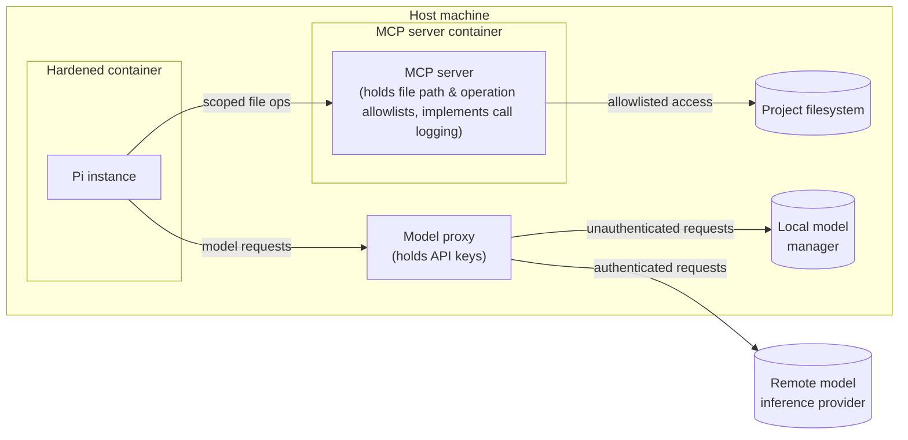
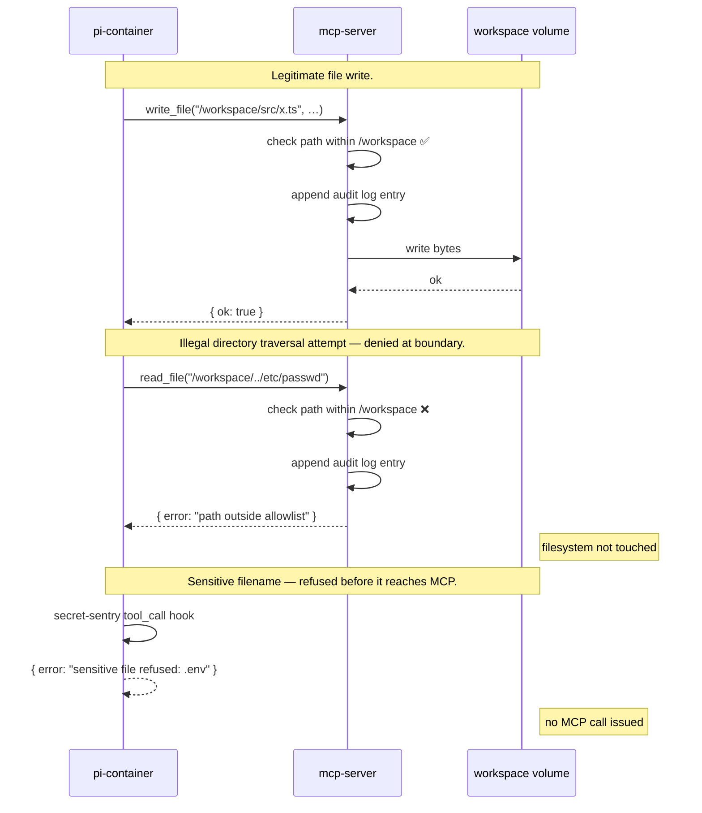
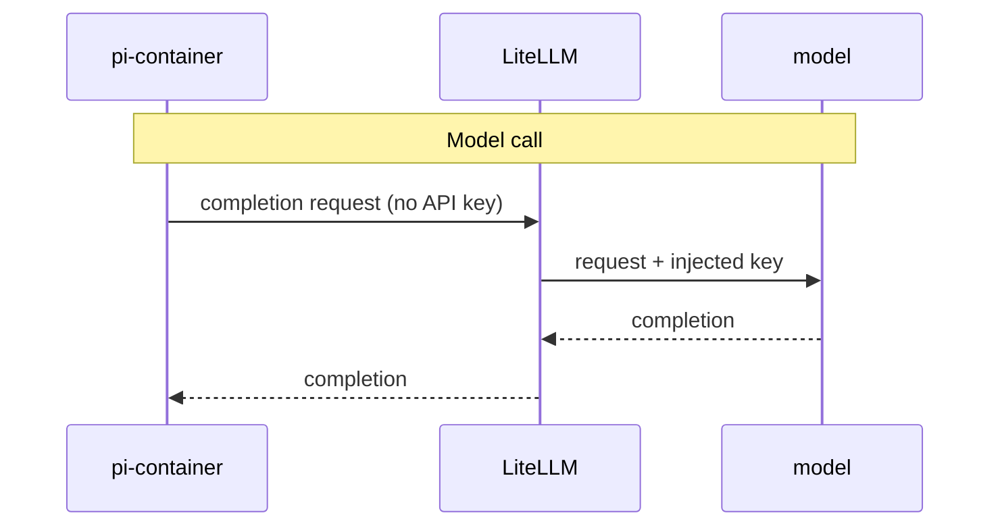
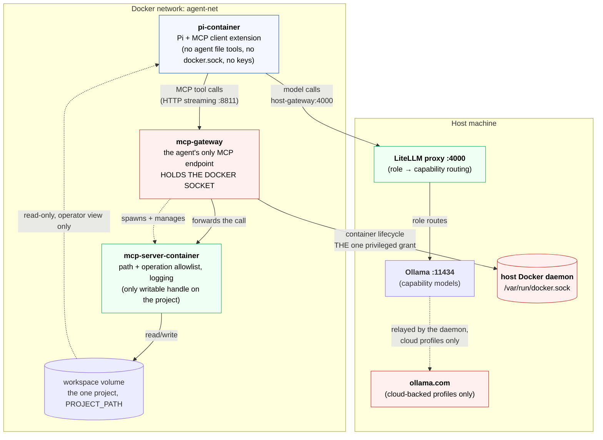

# The solution

I settled on an architecture that revolves around five components:

* Pi extensions.
* A containerized Pi instance.
* A containerized MCP server.
* A proxy for routing traffic to both remote and local model runtime engines.
* A dedicated Docker network connecting the above.



## Pi extensions

The first layer of defense in my hardened agent harness design is a suite of
Pi extensions that add security controls. Five hooks are handled, across
**three** extensions, and this section describes what they do rather than what
the extension API makes possible — the two drifted apart once before, and the
second is the thing that gets read as a claim.

`secret-sentry` and `audit-log` used to be a single extension. They are split
by responsibility now: `secret-sentry` **decides** (refuses a call naming a
sensitive file, redacts secret-shaped output) and logs only those decisions;
`audit-log` **records** everything else (every call, turn boundaries,
model-request shapes), with no power to refuse or alter anything. Both
register a `tool_call` handler, and Pi's runner stops dispatching a `tool_call`
event to further extensions the instant any handler blocks it — so whether
`audit-log` ever sees a call `secret-sentry` refuses depends on an extension
load order Pi does not guarantee. `secret-sentry`'s own log is therefore the
authoritative record of what it refused, regardless of that order; see both
extensions' READMEs for the full reasoning.

- **`tool_call`** (`secret-sentry`, `audit-log`). Fires before any tool
  executes. `secret-sentry`'s handler can block with
  `{ block: true, reason: string }` — the absolute refusal of sensitive
  filenames — and logs only a refusal, to its own file. `audit-log`'s handler
  never blocks; it records what every call it is dispatched named, to a
  separate file, with no verdict attached (see above for why it cannot claim
  one). There is no confirmation prompt in either — this stack runs
  unattended, so mutating calls proceed unprompted. This remains the only kind
  of hook that sees *every* tool call, whichever extension registered it,
  which is why the filename refusal lives in one of its handlers rather than
  closer to the filesystem.

- **`tool_result`** (`secret-sentry`, `audit-log`). Fires after a tool
  executes, carrying `isError`. `audit-log`'s handler records what the call
  actually *did*, joined to the attempt by Pi's `toolCallId` — without it the
  trail records admissions and calls them outcomes: a read of a path outside
  `/workspace` is admitted by the gate and then refused by the MCP server, and
  only this hook sees the refusal. A call `secret-sentry` blocked never
  reaches this hook at all, so it simply has no result line.

  `secret-sentry`'s handler is the one in the design that **changes what the
  agent sees**. Secret-shaped values — PEM private key blocks, AWS access key
  ids, GitHub/Slack/Anthropic/OpenAI key prefixes — are replaced with
  `[redacted: <rule>]` before the output reaches the model. Pi honours returned
  content as a replacement, so the redaction lands in both the model's context
  and the session transcript; a redacted secret is absent from the history that
  would be re-sent on resume. Detection anchors on literal prefixes and
  delimiters, never on entropy, because a false positive silently corrupts what
  the model reads. When it fires, `secret-sentry` records how many spans were
  replaced and which rules matched — never the value — in its own file, not
  `audit-log`'s.

  Neither handler ever logs the event's `content`, which carries the tool's
  full output. Recording it would copy every file the agent reads into the
  audit trail.

- **`before_agent_start`** (`audit-log`). Fires when the operator submits
  an instruction, before the agent loop runs. Used solely to append a turn
  boundary, so the calls that follow are attributable to the instruction that
  caused them rather than to a timestamp range. The handler records an ordinal
  and the session id and nothing else: the event carries the prompt and the
  fully assembled system prompt, and logging either would put the conversation
  into the audit trail.

- **`before_provider_request`** (`audit-log`). Fires before each model
  call. Used to record the request's **shape** — the model id, the message
  count, and the serialised size — and nothing else. The event's payload is the
  entire conversation, including the contents of every file the agent has read,
  so the handler extracts named scalars and never spreads it. Two consequences
  worth stating: the trail shows *that* the agent sent a request and how much
  context it carried, and it cannot show *what* was sent. Reading the
  conversation means reading the session transcript, which is a different record
  with a different purpose.

  The handler returns `undefined` deliberately. Pi treats any other return value
  from this hook as a replacement payload, so a logging handler that returned
  something would silently rewrite the request.

- **`session_start`** (`mcp-client`). Registers the `mcp_*` tools against the
  gateway, which is the agent's entire file surface.

Pi offers further hooks this build does not handle — `after_provider_response`
(status and headers of the provider's reply) and `context` (the message list
before each model call) among them.

Note what recording the request shape does *not* do. It is written **inside the
agent's own process**, so it is an audit trail in the same cooperative sense the
rest of this extension is: it is evidence, not a boundary. An independent record
would have to come from the host-side LiteLLM proxy, which sees the same traffic
and holds the credentials. That option is deliberately not taken, and `TODO.md`
records why — the proxy has no durable log today, adding one means a Python
callback and a host-side trail outside this stack's volumes, retention policy,
and verification checks, and it could not attribute a request to a turn or a
session because it knows about neither.

Pi also supports **tool overriding** — registering a tool with the same name as
a built-in replaces it. This design does not use it. It relies on
`--no-builtin-tools` instead, which starts Pi with no built-in tools at all, so
there is nothing to override and the `mcp_*` tools are the whole surface. An
earlier iteration did override built-ins, from an `audited-tools` extension
that has since been removed; see `TODO.md` for why replacing a tool in the
agent's own process is a weaker control than not having the tool.

This project uses the second half of that and deliberately not the first. An
overriding tool runs inside the agent's own process, so any policy it enforces
is cooperative — the agent is asked to police itself. `--no-builtin-tools`
removes the capability outright instead, and `mcp-client` hands back only the
`mcp_*` tools, whose containment is enforced in another container. See
`TODO.md` for the removal of the `audited-tools` extension, which made this
argument concrete.

## Containerized Pi instance

The next layer of defense is a dedicated, hardened container for running Pi
agents in. Guest agents have no direct access to the host filesystem. There's
no access to Docker sockets either, preventing badly behaving models from
taking control of the host's Docker daemon.

Be precise about the scope of that last claim: it is about the **agent's**
container. One component of the stack — the MCP gateway — does hold a host
Docker socket, because it spawns the MCP server. The requirement in
`docs/requirements.md` that a compromised agent must not reach "host Docker
control" is met by confining that privilege to a component the agent cannot
reach, not by the stack holding no privilege anywhere. See
[the `docker.sock` trade-off](#the-gateway-and-the-dockersock-trade-off) below.

The container does carry one project mount, at `/workspace`, and it is worth
being precise about who it is for. It is mounted **read-only, for the human
operator** — someone who enters the container needs to see what they are
working with. It is not the agent's route to files and cannot become one:
Pi runs with `--no-builtin-tools`, so it has no `read`, `grep`, `find`, or
`edit` to point at that mount, and no extension restores them. The `mcp_*`
tools are the agent's only file surface, and they resolve inside the MCP
server's container, not this one. The `:ro` flag is the backstop — even if a
local tool were ever restored, the only *writable* handle on the project
stays with the MCP server, so the audit trail of changes remains complete.

All interactions with the outside world happen via:

* The MCP server (for tools and data access).
* The model proxy (for inference requests).

### The agent's tool surface, exhaustively

"The agent has no local tools" is easy to read as a figure of speech. It is
literal, and this is the entire list — enumerated here because a reader should
not have to infer a security boundary from three flags in a launcher script.

Everything the model can call, verified against the running stack (`tools/list`
on the gateway) rather than from the design's intent:

| Tool | Arguments | Kind |
|---|---|---|
| `mcp_read_file` | `path` | read |
| `mcp_list_directory` | `path` | read |
| `mcp_search_files` | `path`, `pattern`, `excludePatterns` | read |
| `mcp_list_allowed_directories` | — | read |
| `mcp_write_file` | `path`, `content` | write |
| `mcp_edit_file` | `path`, `edits`, `dryRun` | write |
| `mcp_move_file` | `source`, `destination` | write |
| `mcp_create_directory` | `path` | write |

Eight tools. All filesystem. All resolve inside the MCP server's container,
confined to `/workspace`. The four writes run unprompted — there is nobody to
ask in unattended operation; any of the eight is refused outright if it names a
sensitive file (`secret-sentry`); and every call, read or write, is logged
(`audit-log`).

**Eight of the eleven the server exposes.** The `mcp/filesystem` image also
offers `read_multiple_files`, `directory_tree`, and `get_file_info`; the
gateway's `--tools` allowlist (`compose.yaml`) does not enable them. That flag
is enforced at the boundary, out of the agent's process, and can only subtract
from what the catalog's servers expose — nothing can be added through it.

Each omission is justified by a **kept tool doing the same job**, rather than by
how often the call log has seen it used: `read_file` replaces
`read_multiple_files`, one call and one audit line per file;
`list_directory` plus `search_files` replaces `directory_tree`,
which is the only tool here with unbounded output and could pull a whole tree
into the model's context in one call; and `get_file_info` returns metadata
nothing in a coding task needs. `list_allowed_directories` is **kept**, because
nothing else tells the agent that its project root is `/workspace`.

The trimming is defence in depth, not a new boundary — all eleven are filesystem
tools already confined to `/workspace`. Verified against the running gateway
rather than assumed: the withheld three are not merely absent from `tools/list`
but refused when called (`unknown tool "directory_tree"`), while
`list_directory(/workspace)` still works and `read_file(/etc/passwd)` is still
refused by the MCP server. `TODO.md` records what is still open here, which is
whether the *used* set is narrower still; that needs interactive session data,
including writes, which the current sample lacks.

That is the complete surface because only three extensions ship in the image —
`mcp-client`, which registers exactly the tools above; `secret-sentry`, which
registers none and only decides (refuse, redact); and `audit-log`, which
registers none either and only observes.

**No `bash`, and no execution of any kind.** Pi ships seven built-in tools —
`read`, `bash`, `edit`, `write`, `grep`, `find`, `ls` — and `start-pi` launches
with `--no-builtin-tools`, so none of them is offered to the model. This is the
control, not tidying: those built-ins operate on *this* container's filesystem,
so leaving them enabled would hand the agent an unmediated route to every file
in the container, not just the project at `/workspace` — the MCP server's
containment never comes into play for a call that never reaches it.
`secret-sentry`'s and `audit-log`'s hooks fire for any tool call and would
still refuse by filename and log, respectively, but that is a cooperative
control inside the agent's own process, not the boundary containment
provides. There is no `audited-tools` extension restoring a guarded `bash`
either; it was removed for the same reason.

**No Git.** There is no `git` tool and no `git` binary in the image. Version
control is the operator's job, on the host, where the audit trail of what the
agent changed is reviewed before anything is committed.

**No web fetch.** Pi ships no web or HTTP tool at all — the built-in list above
is the whole of it — and no extension adds one. The agent cannot retrieve a URL.

**No network binaries.** `curl`, `wget`, `nc`, and `ssh` are all absent from the
image, so even a future execution tool would find nothing to reach the network
with.

What this costs is real and worth stating: the agent **cannot run the project's
tests, build it, install a dependency, or check out a branch**. It reads and
edits files, and nothing else. If that ever needs to change, `TODO.md` records
the design for an out-of-process exec MCP server — deliberately not an extension
inside the agent, for the reason given above.

> [!NOTE]
> This is a statement about the agent's **tool surface**. Network reachability
> is now constrained separately and independently: `agent-net` is declared
> `internal: true`, so the container has no default route and no outbound NAT.
> External addresses fail with `ENETUNREACH` and DNS does not resolve. The two
> controls are worth keeping distinct — the tool surface is why nothing *wants*
> to reach the network, the internal network is why nothing *can*.

The user experience is unchanged. Users interact with Pi in the normal way.
Only the plumbing beneath the agent changes.

Pi's own documentation names three containerization patterns for this layer,
in ascending order of security, and plain Docker — the pattern above — is the
weakest of the three. Its limitation for regulated use is that credential
isolation is not built in: without the model proxy this stack adds separately
(see below), API keys would have to be injected into the container the agent
itself runs in.

**Gondolin** is the middle option: a local Linux micro-VM
extension. Pi itself keeps running on the host — its process, its config, and
its credentials never leave — and only built-in tool *execution* is routed
into the VM. That is a narrower boundary than this stack's: it hardens where
a `bash` or `edit` call runs, but says nothing about where Pi's own process
holds its keys, which is exactly the gap the model proxy below exists to
close for the Docker pattern instead.

[**OpenShell**][openshell] (NVIDIA) is the most secure of the three, and the
closest Pi's own documentation describes to a batteries-included regulated
setup. It provides policy-controlled sandboxing — filesystem, process,
network, credential, and inference controls in one place — running sandboxes
through a local gateway (Docker, Podman, or VM) or a remote Kubernetes
gateway. Critically, it is the only Pi-native pattern that keeps raw model API
keys **entirely** outside the sandbox: code inside calls a fixed
`https://inference.local` address and the gateway injects credentials
upstream, so the sandboxed process never holds a key at all. Against that,
Docker is acceptable here only because this stack builds the same credential
isolation itself, by another mechanism — the [host-side model proxy](#model-traffic-proxy)
below plays OpenShell's gateway role, holding every cloud API key so the
container never does.

OpenShell requires an external gateway and is aimed primarily at enterprise or
team deployments, not a single local developer setup — which is why this
stack does not adopt it outright. For a local, regulated developer setup, the
realistic path stays the one this document builds: hardened Docker, with a
host-side model proxy so keys never enter the container, `--no-builtin-tools`,
the audit-log and secret-sentry extensions, a `permission-gate` extension for
eyes-on sessions, and session storage on a controlled — ideally encrypted —
volume outside the working tree.

[openshell]: https://build.nvidia.com/openshell

## Containerized MCP server

Access to files, data, and tools is mediated by a containerized MCP (Model
Context Protocol) server. This is responsible for enforcing path and operation
allowlists. It also logs every call, providing full auditability.

Running MCP servers directly on the host machine would still give a model
access to the host filesystem, environment variables, and network. Putting
the MCP server in a Docker container keeps the model isolated from the host
environment.

For all operations that don't involve model inference, the agent issues MCP
tool calls. The containerized MCP server enforces what tool calls are allowed.
Thus, the MCP server becomes the gatekeeper to the host system. Access is
mediated using scoped allowlists. Every call is logged.

The allowlist is a single directory: `/workspace`, the one project this stack
is scoped to (see `docs/requirements.md`). That boundary is declared in the
Docker MCP Toolkit catalog entry (`src/infrastructure/mcp/toolkit/catalog.yaml`),
whose `command` argument is the allowed directory and whose `volumes` entry is
all the spawned server can see. Those two must name the same path — if they
disagree, the server confines itself to a directory it cannot reach and every
call fails.

### The gateway, and the `docker.sock` trade-off

The MCP server is not a sibling container that compose starts. The **Docker MCP
Toolkit gateway** starts it: the agent connects to the gateway, and the gateway
spawns and manages the `mcp/filesystem` server from the catalog entry above.
That indirection is why the catalog file exists at all — and it has a
consequence that belongs here rather than only in the compose comments.

**Because the gateway orchestrates containers, it holds the host Docker
socket.** `compose.yaml` binds `/var/run/docker.sock` into the `mcp-gateway`
service. This is real host privilege: control of the Docker daemon is control of
the host, and it is the single most privileged thing in this design.

`docs/requirements.md` names this exact risk — a compromised agent must not
reach "host Docker control" — so the design has to answer for it. The answer is
**confinement, not absence**. The privilege exists, but on a component the agent
cannot reach:

* The **agent** container has no socket, no cloud keys, and no writable project
  mount. Nothing it can call reaches the daemon: it has no local execution tool
  at all, and its `mcp_*` tools resolve inside the filesystem server's
  container.
* The **gateway** is not addressable from outside the stack. `agent-net` is a
  private bridge, port 8811 is not published to the host, and its only other
  member is the agent container.
* The gateway is hardened as far as its role permits — `cap_drop: [ALL]`,
  `no-new-privileges`, read-only rootfs with in-memory tmpfs, and memory/PID
  limits. The socket is the irreducible privilege; everything else is shut.

So the requirement is met at the boundary that matters — the agent — rather than
by the stack holding no privilege anywhere. That distinction is the honest
version of the claim, and the diagrams below name the gateway explicitly so they
cannot be read the other way.

Two escape hatches, should the raw socket bind be unacceptable:

* Replace it with a
  [docker-socket-proxy](https://github.com/Tecnativa/docker-socket-proxy)
  allowlisting only the container APIs the gateway needs.
* Run `mcp/filesystem` directly over stdio without the gateway — at the cost of
  the Toolkit's catalog, secret, and network controls.

`src/infrastructure/README.md` covers both, with the operational detail and the
catalog-schema caveats that go with them.



This design aligns with emerging best practices for secure agent harnesses. MCP
has emerged as the _de facto_ isolation boundary for agents, controlling an
agent's access to filesystems, tools, and data.

Tooling in this solution space is mature. I've chosen to use
[Docker MCP Toolkit][docker-mcp-toolkit]. It runs MCP servers in containers
and handles the plumbing to the agent client. Docker MCP Toolkit can also be
configured with environment variables, API keys, and any other secrets required
by an agent. It acts as a proxy for this information, so secrets never enter
a model's context.

Docker MCP Toolkit also has built-in security checks for both tool calls and the
resulting outputs.

## Model traffic proxy

Similar to how an MCP server mediates an agent's access to tools and data, so
another proxy sits between the agent and the model runtimes. This proxy holds
the access credentials required to access model inference providers.

This design means that cloud credentials and other secrets are never injected
into running agent containers — not via environment variables, not mounted into
containers via config files, and not baked into container images. The agent
container is only given the model's proxy endpoint.

This is an emerging design pattern, and [LiteLLM][lite-llm] is emerging as the
_de facto_ standard. It is a lightweight model router, sitting between the agent
and the models the agent uses, and presenting a unified OpenAI-compatible API.



LiteLLM can route requests to different local or cloud models based on rules
you define, allowing for the configuration of dynamic model routing in response
to the task at hand. You can also configure LiteLLM with per-model token
budgets and rate limits.

```
agent
  └── model router (LiteLLM)
        ├── local (eg. ollama - low latency, no data leaves machine)
        └── cloud (eg. Anthropic API - for frontier model access)
```

LiteLLM runs directly on the host, rather than in its own container like Pi and
the MCP server. This is because the proxy needs host-level access to reach local
model servers such as Ollama.

## High-level design

The following provides alternative views of the high-level design.

The diagram below shows the trust boundaries, and what data crosses them.



The gateway is drawn in the danger style deliberately: it is the one component
holding host privilege. The agent has no path to it other than MCP tool calls,
and no path to the daemon at all.

The view below adds some concrete mount/volume detail.

```
Host Machine
│
├── Ollama :11434 - on loopback; the proxy runs on the host and reaches it there
│     └── capability models built by the modelfiles project. The profile built
│         there decides local vs. cloud-backed; cloud ones are relayed to
│         ollama.com by the daemon, under the daemon's own identity.
│
├── LiteLLM proxy :4000 - routes a ROLE to a CAPABILITY; holds no provider key
│     ├── "computer-programmer" → Ollama computer-programming
│     ├── "technical-lead"      → Ollama technical-reasoning
│     ├── "technical-writer"    → Ollama prose-writing
│     └── "security-analyst"    → Ollama security-analysis
│
└── Docker network: agent-net
    │
    ├── pi-container
    │   ├── Pi process + MCP client extension
    │   ├── /home/pi - Pi config + session history (saved to named volume)
    │   ├── /var/log/pi - the tool-call audit trail (named volume)
    │   └── /workspace - the project, READ-ONLY, for the operator to browse.
    │         The agent has no local tool that can read it.
    │
    ├── mcp-gateway - the agent's only MCP endpoint, on :8811 (unpublished)
    │   ├── /etc/mcp/catalog.yaml - READ-ONLY. Declares the boundary: the
    │   │     allowed directory and what the spawned server can see.
    │   ├── /workspace - the project volume, passed through to the server
    │   │     it spawns.
    │   └── /var/run/docker.sock - THE HOST DOCKER SOCKET. The one
    │         privileged mount in the stack, required because the gateway
    │         spawns and manages the MCP server container. Never granted
    │         to the agent. See the docker.sock trade-off above.
    │
    └── mcp-server-container - spawned BY THE GATEWAY, not by compose
        ├── MCP server process
        │   Enforces path allowlist, operation allowlist, logging
        │
        └── /workspace - the same named volume (read/write). The only
              writable handle on the project. One project per stack;
              a second project means a second stack.
```

The following table summarizes all the custom security hardening solutions
implemented in my agent harness infrastructure. This view adds more detail
to what's described above.

| Requirement                         | Hardening solution                                                                                                                                                      |
|-------------------------------------|-------------------------------------------------------------------------------------------------------------------------------------------------------------------------|
| Filesystem access control           | ALL agent file access mediated by the MCP server, reached by the `mcp-client` extension. The project is mounted read-only in the agent container for the human operator to browse; the agent has no local tool that can read it (`--no-builtin-tools`, and no extension restores one), and the MCP server holds the only writable handle. |
| Project scoping                     | Exactly ONE project per stack, at `/workspace`, set by `PROJECT_PATH`. The allowlist is therefore a single directory rather than a per-project permission model — see `docs/requirements.md` for why this is a requirement and not an unfinished feature. Two projects means two stacks. |
| Agent tool surface                  | Exactly eight `mcp_*` filesystem tools, enumerated in "The agent's tool surface, exhaustively" above — eight of the eleven the server exposes, narrowed by the gateway's `--tools` allowlist, which is enforced out of the agent's process and can only subtract. No `bash`, no Git, no web fetch, no execution of any kind — and no `git`/`curl`/`wget`/`nc`/`ssh` binaries in the image. Pi's seven built-ins are disabled by `--no-builtin-tools` in `start-pi`; only `mcp-client` (which registers whatever the gateway offers), `secret-sentry`, and `audit-log` (neither of which registers any tool) ship in the image. Re-verify with the tool-surface check in the runbook. |
| Command execution control           | The agent cannot execute anything. `--no-builtin-tools` removes Pi's `bash`, and no extension provides a replacement, so there is no execution surface to police. This replaced an `audited-tools` extension that allowlisted commands from inside the agent's own process — a cooperative guard whose fence was self-enforced and lexical, and which interpreters on its allowlist (`node -e`, `python3 -c`) could read straight through. Removing the capability is the stronger control. See `TODO.md`, which also records the deferred option of an out-of-process exec MCP server should execution ever be needed. |
| Permission prompts / approval gates | NOT IMPLEMENTED here, deliberately. This stack runs unattended, and a confirmation prompt nobody is present to answer could only ever time out and default-deny — theatre, not a control. Mutating calls (writes, edits, moves, directory creation) proceed unprompted, logged the same as any other call. pi's `permission-gate` extension provides this for eyes-on, at-keyboard sessions instead. |
| Sensitive-file refusal              | `secret-sentry` refuses any call naming secrets or key material (`.env*`, `id_rsa`, `*.pem`, `*.key`, …) on filename patterns. Absolute — no approval path — and applied to every tool call, `mcp_*` included. |
| Secret redaction from tool output   | `secret-sentry` replaces secret-shaped values in tool output with `[redacted: <rule>]` before the model sees them (`tool_result`), covering the filename rule's blind spot: a key pasted into an ordinary file. Six rules, each anchored on a literal delimiter or issuer prefix; **no entropy heuristic**, because a false positive silently corrupts what the model reads. The replacement reaches the session transcript too, so the value is absent from the history re-sent on resume. In-process, so defence in depth rather than a boundary — and text only, so a secret in an image is not covered. |
| Audit log of tool calls             | TWO append-only JSONL files, on the same dedicated volume, one per extension. `audit-log`'s `calls.jsonl` covers **every** call it is dispatched — reads and writes alike, since nothing is ever prompted for here — writing **two lines** per completed call, joined by `id`: `phase:"call"` records what a call named, `phase:"result"` records what the tool actually did (`tool_result`'s `isError`). Both are needed — nothing here decides admission, so a read the MCP server later refuses is recorded on attempt and again as `error` on result. Two further line kinds carry no `phase`: `kind:"turn_start"` marks each turn boundary (`before_agent_start`), and `kind:"provider_request"` records the shape of each outbound model request (`before_provider_request`) — model id, message count, serialised size, and a SHA-256 hash of the serialised body. None of the four carries the prompt, the conversation, or any file content. `secret-sentry`'s `security.jsonl` covers only the two decisions it makes: `kind:"blocked"` (the path and reason for a refused call) and `kind:"redaction"` (a count and the rule names, never the value), each also carrying `id` so the two files can be joined. A refused call may or may not appear in `audit-log`'s file at all — Pi stops dispatching a `tool_call` event to further extensions the instant one blocks it, and which extension's handler runs first is not guaranteed — so `secret-sentry`'s file is the authoritative record of what it refused, independent of that order. Both volumes must be owned by the agent's uid or logging fails silently. |
| API key isolation from agent        | Host-side LiteLLM proxy holds API keys (eg. `ANTHROPIC_API_KEY`/`OPENAI_API_KEY`). Agent container gets a proxy endpoint + low-value rotatable proxy token.             |
| Extension vetting / signing         | Extensions require manual review. Third-party packages MUST be pinned to exact versions/commit hashes.                                                                  |
| Network egress control              | ENFORCED. `agent-net` is `internal: true`, so Docker installs no default route and no masquerade rule for it: external addresses are `ENETUNREACH` and DNS does not resolve. The container's only reachable peers are the MCP gateway and the host LiteLLM proxy. Because an internal network has no route to docker0, the proxy is reached at this network's own pinned gateway address (`extra_hosts`), not via Docker's `host-gateway` alias — the subnet pin in `compose.yaml` and that `extra_hosts` entry are one setting in two places. This is what rules out the gateway's `--verify-signatures`, which needs the sigstore TUF mirror; see `TODO.md`. |
| Container hardening (agent)         | Non-root user, `--cap-drop ALL`, `no-new-privileges`, read-only rootfs with tmpfs `/tmp`, memory/CPU/PIDs limits, no `docker.sock`, no host-dotfile mounts, and the project mounted read-only for the operator only. |
| Host Docker control                 | The agent has **no** Docker socket. The `mcp-gateway` **does** — it spawns and manages the MCP server container, so `compose.yaml` binds `/var/run/docker.sock` into it. This is the one privileged grant in the design, and it is confined rather than eliminated: the gateway is unreachable from outside the stack (private bridge, unpublished port, agent as its only peer) and is itself hardened with `cap_drop: [ALL]`, `no-new-privileges`, and a read-only rootfs. `docs/requirements.md` requires that a compromised *agent* cannot reach host Docker control; that is what is enforced. See "The gateway, and the `docker.sock` trade-off" above, and `src/infrastructure/README.md` for the socket-proxy and stdio alternatives. |
| Startup telemetry / network calls   | `PI_OFFLINE=1` / `PI_SKIP_VERSION_CHECK=1` disable Pi's built-in telemetry and version-check calls. This is now belt-and-braces rather than the control itself: with `agent-net` internal, such a call has nowhere to go even if the setting were lost. |
| Session data retention              | `sessionDir` set to a named volume outside the project tree (`pi-sessions`). JSONL logs hold the full conversation, including file content reads.                       |
| Session data encryption at rest     | NOT IMPLEMENTED. Depends on the host volume back-end (eg. an encrypted disk).                                                                                           |
| Data classification                 | NOT IMPLEMENTED. No extension inspects tool *content* by sensitivity; the filename-pattern refusal in `secret-sentry/sensitive-files.ts` classifies by name only.     |
| Prompt injection defense            | OUT-OF-SCOPE for the agent harness. This is a model-level concern.                                                                                                      |

[docker-mcp-toolkit]: https://docs.docker.com/ai/mcp-catalog-and-toolkit/toolkit/
[lite-llm]: https://www.litellm.ai/
